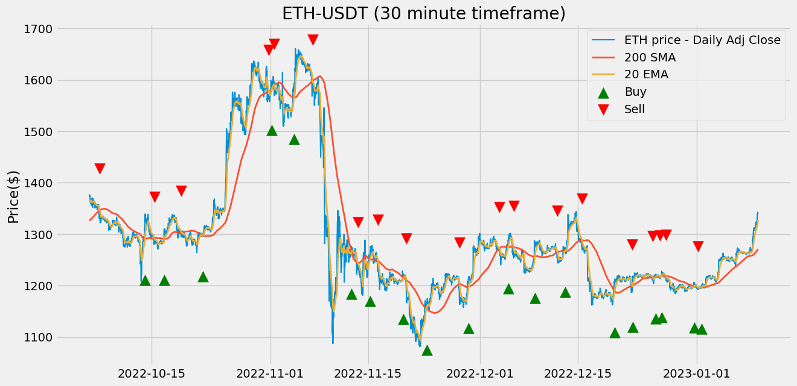
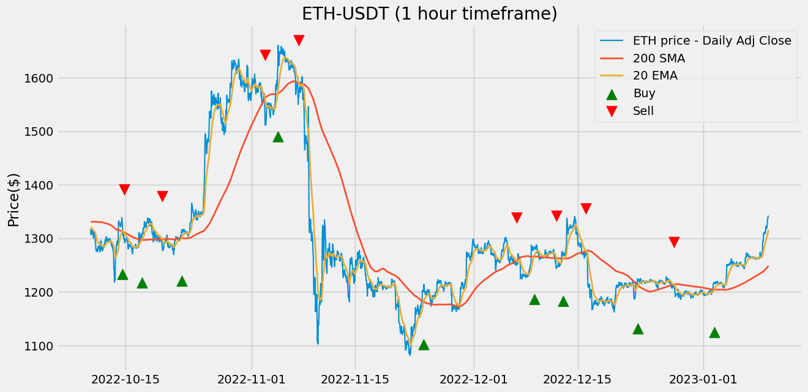

Using Historic_Crypto API ([David-Woroniuk/Historic_Crypto](https://github.com/David-Woroniuk/Historic_Crypto))


```python
import pandas as pd
import numpy as np
import matplotlib.pyplot as plt
```


```python
from Historic_Crypto import HistoricalData
import datetime 

tod = datetime.datetime.now()
d = datetime.timedelta(days = 100)
a = tod - d
# print(a.strftime("%Y-%m-%d-00-00"))
new = HistoricalData('ETH-USD',300, a.strftime("%Y-%m-%d-00-00")).retrieve_data()

print(new)

new.to_csv('eth_since_' + a.strftime("%Y%m%d") + '.csv', sep=',')

```

    Checking input parameters are in the correct format.
    Formatting Dates.
    Checking if user supplied is available on the CoinBase Pro API.
    Connected to the CoinBase Pro API.
    Ticker 'ETH-USD' found at the CoinBase Pro API, continuing to extraction.
    Provisional Start: 2022-10-02T00:00:00
    Provisional End: 2022-10-03T01:00:00
    Data for chunk 1 of 97 extracted
    

    C:\Users\sean1\AppData\Local\Programs\Python\Python310\lib\site-packages\Historic_Crypto\HistoricalData.py:176: FutureWarning: The frame.append method is deprecated and will be removed from pandas in a future version. Use pandas.concat instead.
      data = data.append(dataset)
    

    Provisional Start: 2022-10-03T01:00:00
    Provisional End: 2022-10-04T02:00:00
    Data for chunk 2 of 97 extracted
    Provisional Start: 2022-10-04T02:00:00
    Provisional End: 2022-10-05T03:00:00
    Data for chunk 3 of 97 extracted
    Provisional Start: 2022-10-05T03:00:00
    Provisional End: 2022-10-06T04:00:00
    Data for chunk 4 of 97 extracted
    

    C:\Users\sean1\AppData\Local\Programs\Python\Python310\lib\site-packages\Historic_Crypto\HistoricalData.py:176: FutureWarning: The frame.append method is deprecated and will be removed from pandas in a future version. Use pandas.concat instead.
      data = data.append(dataset)
    

    Provisional Start: 2022-10-06T04:00:00
    Provisional End: 2022-10-07T05:00:00
    Data for chunk 5 of 97 extracted
    

    C:\Users\sean1\AppData\Local\Programs\Python\Python310\lib\site-packages\Historic_Crypto\HistoricalData.py:176: FutureWarning: The frame.append method is deprecated and will be removed from pandas in a future version. Use pandas.concat instead.
      data = data.append(dataset)
    

    Provisional Start: 2022-10-07T05:00:00
    Provisional End: 2022-10-08T06:00:00
    Data for chunk 6 of 97 extracted
    Provisional Start: 2022-10-08T06:00:00
    Provisional End: 2022-10-09T07:00:00
    

    C:\Users\sean1\AppData\Local\Programs\Python\Python310\lib\site-packages\Historic_Crypto\HistoricalData.py:176: FutureWarning: The frame.append method is deprecated and will be removed from pandas in a future version. Use pandas.concat instead.
      data = data.append(dataset)
    

    Data for chunk 7 of 97 extracted
    

    C:\Users\sean1\AppData\Local\Programs\Python\Python310\lib\site-packages\Historic_Crypto\HistoricalData.py:176: FutureWarning: The frame.append method is deprecated and will be removed from pandas in a future version. Use pandas.concat instead.
      data = data.append(dataset)
    

    Provisional Start: 2022-10-09T07:00:00
    Provisional End: 2022-10-10T08:00:00
    Data for chunk 8 of 97 extracted
    Provisional Start: 2022-10-10T08:00:00
    Provisional End: 2022-10-11T09:00:00
    

    C:\Users\sean1\AppData\Local\Programs\Python\Python310\lib\site-packages\Historic_Crypto\HistoricalData.py:176: FutureWarning: The frame.append method is deprecated and will be removed from pandas in a future version. Use pandas.concat instead.
      data = data.append(dataset)
    

    Data for chunk 9 of 97 extracted
    

    C:\Users\sean1\AppData\Local\Programs\Python\Python310\lib\site-packages\Historic_Crypto\HistoricalData.py:176: FutureWarning: The frame.append method is deprecated and will be removed from pandas in a future version. Use pandas.concat instead.
      data = data.append(dataset)
    

    Provisional Start: 2022-10-11T09:00:00
    Provisional End: 2022-10-12T10:00:00
    Data for chunk 10 of 97 extracted
    

    C:\Users\sean1\AppData\Local\Programs\Python\Python310\lib\site-packages\Historic_Crypto\HistoricalData.py:176: FutureWarning: The frame.append method is deprecated and will be removed from pandas in a future version. Use pandas.concat instead.
      data = data.append(dataset)
    

    Provisional Start: 2022-10-12T10:00:00
    Provisional End: 2022-10-13T11:00:00
    Data for chunk 11 of 97 extracted
    

    C:\Users\sean1\AppData\Local\Programs\Python\Python310\lib\site-packages\Historic_Crypto\HistoricalData.py:176: FutureWarning: The frame.append method is deprecated and will be removed from pandas in a future version. Use pandas.concat instead.
      data = data.append(dataset)
    

    Provisional Start: 2022-10-13T11:00:00
    Provisional End: 2022-10-14T12:00:00
    Data for chunk 12 of 97 extracted
    

    C:\Users\sean1\AppData\Local\Programs\Python\Python310\lib\site-packages\Historic_Crypto\HistoricalData.py:176: FutureWarning: The frame.append method is deprecated and will be removed from pandas in a future version. Use pandas.concat instead.
      data = data.append(dataset)
    

    Provisional Start: 2022-10-14T12:00:00
    Provisional End: 2022-10-15T13:00:00
    Data for chunk 13 of 97 extracted
    Provisional Start: 2022-10-15T13:00:00
    Provisional End: 2022-10-16T14:00:00
    

    C:\Users\sean1\AppData\Local\Programs\Python\Python310\lib\site-packages\Historic_Crypto\HistoricalData.py:176: FutureWarning: The frame.append method is deprecated and will be removed from pandas in a future version. Use pandas.concat instead.
      data = data.append(dataset)
    

    Data for chunk 14 of 97 extracted
    

    C:\Users\sean1\AppData\Local\Programs\Python\Python310\lib\site-packages\Historic_Crypto\HistoricalData.py:176: FutureWarning: The frame.append method is deprecated and will be removed from pandas in a future version. Use pandas.concat instead.
      data = data.append(dataset)
    

    Provisional Start: 2022-10-16T14:00:00
    Provisional End: 2022-10-17T15:00:00
    Data for chunk 15 of 97 extracted
    

    C:\Users\sean1\AppData\Local\Programs\Python\Python310\lib\site-packages\Historic_Crypto\HistoricalData.py:176: FutureWarning: The frame.append method is deprecated and will be removed from pandas in a future version. Use pandas.concat instead.
      data = data.append(dataset)
    

    Provisional Start: 2022-10-17T15:00:00
    Provisional End: 2022-10-18T16:00:00
    Data for chunk 16 of 97 extracted
    Provisional Start: 2022-10-18T16:00:00
    Provisional End: 2022-10-19T17:00:00
    

    C:\Users\sean1\AppData\Local\Programs\Python\Python310\lib\site-packages\Historic_Crypto\HistoricalData.py:176: FutureWarning: The frame.append method is deprecated and will be removed from pandas in a future version. Use pandas.concat instead.
      data = data.append(dataset)
    

    Data for chunk 17 of 97 extracted
    Provisional Start: 2022-10-19T17:00:00
    Provisional End: 2022-10-20T18:00:00
    

    C:\Users\sean1\AppData\Local\Programs\Python\Python310\lib\site-packages\Historic_Crypto\HistoricalData.py:176: FutureWarning: The frame.append method is deprecated and will be removed from pandas in a future version. Use pandas.concat instead.
      data = data.append(dataset)
    

    Data for chunk 18 of 97 extracted
    

    C:\Users\sean1\AppData\Local\Programs\Python\Python310\lib\site-packages\Historic_Crypto\HistoricalData.py:176: FutureWarning: The frame.append method is deprecated and will be removed from pandas in a future version. Use pandas.concat instead.
      data = data.append(dataset)
    

    Provisional Start: 2022-10-20T18:00:00
    Provisional End: 2022-10-21T19:00:00
    Data for chunk 19 of 97 extracted
    

    C:\Users\sean1\AppData\Local\Programs\Python\Python310\lib\site-packages\Historic_Crypto\HistoricalData.py:176: FutureWarning: The frame.append method is deprecated and will be removed from pandas in a future version. Use pandas.concat instead.
      data = data.append(dataset)
    

    Provisional Start: 2022-10-21T19:00:00
    Provisional End: 2022-10-22T20:00:00
    Data for chunk 20 of 97 extracted
    Provisional Start: 2022-10-22T20:00:00
    Provisional End: 2022-10-23T21:00:00
    

    C:\Users\sean1\AppData\Local\Programs\Python\Python310\lib\site-packages\Historic_Crypto\HistoricalData.py:176: FutureWarning: The frame.append method is deprecated and will be removed from pandas in a future version. Use pandas.concat instead.
      data = data.append(dataset)
    

    Data for chunk 21 of 97 extracted
    

    C:\Users\sean1\AppData\Local\Programs\Python\Python310\lib\site-packages\Historic_Crypto\HistoricalData.py:176: FutureWarning: The frame.append method is deprecated and will be removed from pandas in a future version. Use pandas.concat instead.
      data = data.append(dataset)
    

    Provisional Start: 2022-10-23T21:00:00
    Provisional End: 2022-10-24T22:00:00
    Data for chunk 22 of 97 extracted
    

    C:\Users\sean1\AppData\Local\Programs\Python\Python310\lib\site-packages\Historic_Crypto\HistoricalData.py:176: FutureWarning: The frame.append method is deprecated and will be removed from pandas in a future version. Use pandas.concat instead.
      data = data.append(dataset)
    

    Provisional Start: 2022-10-24T22:00:00
    Provisional End: 2022-10-25T23:00:00
    Data for chunk 23 of 97 extracted
    Provisional Start: 2022-10-25T23:00:00
    Provisional End: 2022-10-27T00:00:00
    

    C:\Users\sean1\AppData\Local\Programs\Python\Python310\lib\site-packages\Historic_Crypto\HistoricalData.py:176: FutureWarning: The frame.append method is deprecated and will be removed from pandas in a future version. Use pandas.concat instead.
      data = data.append(dataset)
    

    Data for chunk 24 of 97 extracted
    

    C:\Users\sean1\AppData\Local\Programs\Python\Python310\lib\site-packages\Historic_Crypto\HistoricalData.py:176: FutureWarning: The frame.append method is deprecated and will be removed from pandas in a future version. Use pandas.concat instead.
      data = data.append(dataset)
    

    Provisional Start: 2022-10-27T00:00:00
    Provisional End: 2022-10-28T01:00:00
    Data for chunk 25 of 97 extracted
    Provisional Start: 2022-10-28T01:00:00
    Provisional End: 2022-10-29T02:00:00
    

    C:\Users\sean1\AppData\Local\Programs\Python\Python310\lib\site-packages\Historic_Crypto\HistoricalData.py:176: FutureWarning: The frame.append method is deprecated and will be removed from pandas in a future version. Use pandas.concat instead.
      data = data.append(dataset)
    

    Data for chunk 26 of 97 extracted
    Provisional Start: 2022-10-29T02:00:00
    Provisional End: 2022-10-30T03:00:00
    

    C:\Users\sean1\AppData\Local\Programs\Python\Python310\lib\site-packages\Historic_Crypto\HistoricalData.py:176: FutureWarning: The frame.append method is deprecated and will be removed from pandas in a future version. Use pandas.concat instead.
      data = data.append(dataset)
    

    Data for chunk 27 of 97 extracted
    

    C:\Users\sean1\AppData\Local\Programs\Python\Python310\lib\site-packages\Historic_Crypto\HistoricalData.py:176: FutureWarning: The frame.append method is deprecated and will be removed from pandas in a future version. Use pandas.concat instead.
      data = data.append(dataset)
    

    Provisional Start: 2022-10-30T03:00:00
    Provisional End: 2022-10-31T04:00:00
    Data for chunk 28 of 97 extracted
    Provisional Start: 2022-10-31T04:00:00
    Provisional End: 2022-11-01T05:00:00
    

    C:\Users\sean1\AppData\Local\Programs\Python\Python310\lib\site-packages\Historic_Crypto\HistoricalData.py:176: FutureWarning: The frame.append method is deprecated and will be removed from pandas in a future version. Use pandas.concat instead.
      data = data.append(dataset)
    

    Data for chunk 29 of 97 extracted
    

    C:\Users\sean1\AppData\Local\Programs\Python\Python310\lib\site-packages\Historic_Crypto\HistoricalData.py:176: FutureWarning: The frame.append method is deprecated and will be removed from pandas in a future version. Use pandas.concat instead.
      data = data.append(dataset)
    

    Provisional Start: 2022-11-01T05:00:00
    Provisional End: 2022-11-02T06:00:00
    Data for chunk 30 of 97 extracted
    

    C:\Users\sean1\AppData\Local\Programs\Python\Python310\lib\site-packages\Historic_Crypto\HistoricalData.py:176: FutureWarning: The frame.append method is deprecated and will be removed from pandas in a future version. Use pandas.concat instead.
      data = data.append(dataset)
    

    Provisional Start: 2022-11-02T06:00:00
    Provisional End: 2022-11-03T07:00:00
    Data for chunk 31 of 97 extracted
    Provisional Start: 2022-11-03T07:00:00
    Provisional End: 2022-11-04T08:00:00
    

    C:\Users\sean1\AppData\Local\Programs\Python\Python310\lib\site-packages\Historic_Crypto\HistoricalData.py:176: FutureWarning: The frame.append method is deprecated and will be removed from pandas in a future version. Use pandas.concat instead.
      data = data.append(dataset)
    

    Data for chunk 32 of 97 extracted
    

    C:\Users\sean1\AppData\Local\Programs\Python\Python310\lib\site-packages\Historic_Crypto\HistoricalData.py:176: FutureWarning: The frame.append method is deprecated and will be removed from pandas in a future version. Use pandas.concat instead.
      data = data.append(dataset)
    

    Provisional Start: 2022-11-04T08:00:00
    Provisional End: 2022-11-05T09:00:00
    Data for chunk 33 of 97 extracted
    

    C:\Users\sean1\AppData\Local\Programs\Python\Python310\lib\site-packages\Historic_Crypto\HistoricalData.py:176: FutureWarning: The frame.append method is deprecated and will be removed from pandas in a future version. Use pandas.concat instead.
      data = data.append(dataset)
    

    Provisional Start: 2022-11-05T09:00:00
    Provisional End: 2022-11-06T10:00:00
    Data for chunk 34 of 97 extracted
    

    C:\Users\sean1\AppData\Local\Programs\Python\Python310\lib\site-packages\Historic_Crypto\HistoricalData.py:176: FutureWarning: The frame.append method is deprecated and will be removed from pandas in a future version. Use pandas.concat instead.
      data = data.append(dataset)
    

    Provisional Start: 2022-11-06T10:00:00
    Provisional End: 2022-11-07T11:00:00
    Data for chunk 35 of 97 extracted
    Provisional Start: 2022-11-07T11:00:00
    Provisional End: 2022-11-08T12:00:00
    

    C:\Users\sean1\AppData\Local\Programs\Python\Python310\lib\site-packages\Historic_Crypto\HistoricalData.py:176: FutureWarning: The frame.append method is deprecated and will be removed from pandas in a future version. Use pandas.concat instead.
      data = data.append(dataset)
    

    Data for chunk 36 of 97 extracted
    

    C:\Users\sean1\AppData\Local\Programs\Python\Python310\lib\site-packages\Historic_Crypto\HistoricalData.py:176: FutureWarning: The frame.append method is deprecated and will be removed from pandas in a future version. Use pandas.concat instead.
      data = data.append(dataset)
    

    Provisional Start: 2022-11-08T12:00:00
    Provisional End: 2022-11-09T13:00:00
    Data for chunk 37 of 97 extracted
    

    C:\Users\sean1\AppData\Local\Programs\Python\Python310\lib\site-packages\Historic_Crypto\HistoricalData.py:176: FutureWarning: The frame.append method is deprecated and will be removed from pandas in a future version. Use pandas.concat instead.
      data = data.append(dataset)
    

    Provisional Start: 2022-11-09T13:00:00
    Provisional End: 2022-11-10T14:00:00
    Data for chunk 38 of 97 extracted
    

    C:\Users\sean1\AppData\Local\Programs\Python\Python310\lib\site-packages\Historic_Crypto\HistoricalData.py:176: FutureWarning: The frame.append method is deprecated and will be removed from pandas in a future version. Use pandas.concat instead.
      data = data.append(dataset)
    

    Provisional Start: 2022-11-10T14:00:00
    Provisional End: 2022-11-11T15:00:00
    Data for chunk 39 of 97 extracted
    

    C:\Users\sean1\AppData\Local\Programs\Python\Python310\lib\site-packages\Historic_Crypto\HistoricalData.py:176: FutureWarning: The frame.append method is deprecated and will be removed from pandas in a future version. Use pandas.concat instead.
      data = data.append(dataset)
    

    Provisional Start: 2022-11-11T15:00:00
    Provisional End: 2022-11-12T16:00:00
    Data for chunk 40 of 97 extracted
    

    C:\Users\sean1\AppData\Local\Programs\Python\Python310\lib\site-packages\Historic_Crypto\HistoricalData.py:176: FutureWarning: The frame.append method is deprecated and will be removed from pandas in a future version. Use pandas.concat instead.
      data = data.append(dataset)
    

    Provisional Start: 2022-11-12T16:00:00
    Provisional End: 2022-11-13T17:00:00
    Data for chunk 41 of 97 extracted
    

    C:\Users\sean1\AppData\Local\Programs\Python\Python310\lib\site-packages\Historic_Crypto\HistoricalData.py:176: FutureWarning: The frame.append method is deprecated and will be removed from pandas in a future version. Use pandas.concat instead.
      data = data.append(dataset)
    

    Provisional Start: 2022-11-13T17:00:00
    Provisional End: 2022-11-14T18:00:00
    Data for chunk 42 of 97 extracted
    Provisional Start: 2022-11-14T18:00:00
    Provisional End: 2022-11-15T19:00:00
    

    C:\Users\sean1\AppData\Local\Programs\Python\Python310\lib\site-packages\Historic_Crypto\HistoricalData.py:176: FutureWarning: The frame.append method is deprecated and will be removed from pandas in a future version. Use pandas.concat instead.
      data = data.append(dataset)
    

    Data for chunk 43 of 97 extracted
    Provisional Start: 2022-11-15T19:00:00
    Provisional End: 2022-11-16T20:00:00
    

    C:\Users\sean1\AppData\Local\Programs\Python\Python310\lib\site-packages\Historic_Crypto\HistoricalData.py:176: FutureWarning: The frame.append method is deprecated and will be removed from pandas in a future version. Use pandas.concat instead.
      data = data.append(dataset)
    

    Data for chunk 44 of 97 extracted
    

    C:\Users\sean1\AppData\Local\Programs\Python\Python310\lib\site-packages\Historic_Crypto\HistoricalData.py:176: FutureWarning: The frame.append method is deprecated and will be removed from pandas in a future version. Use pandas.concat instead.
      data = data.append(dataset)
    

    Provisional Start: 2022-11-16T20:00:00
    Provisional End: 2022-11-17T21:00:00
    Data for chunk 45 of 97 extracted
    

    C:\Users\sean1\AppData\Local\Programs\Python\Python310\lib\site-packages\Historic_Crypto\HistoricalData.py:176: FutureWarning: The frame.append method is deprecated and will be removed from pandas in a future version. Use pandas.concat instead.
      data = data.append(dataset)
    

    Provisional Start: 2022-11-17T21:00:00
    Provisional End: 2022-11-18T22:00:00
    Data for chunk 46 of 97 extracted
    

    C:\Users\sean1\AppData\Local\Programs\Python\Python310\lib\site-packages\Historic_Crypto\HistoricalData.py:176: FutureWarning: The frame.append method is deprecated and will be removed from pandas in a future version. Use pandas.concat instead.
      data = data.append(dataset)
    

    Provisional Start: 2022-11-18T22:00:00
    Provisional End: 2022-11-19T23:00:00
    Data for chunk 47 of 97 extracted
    Provisional Start: 2022-11-19T23:00:00
    Provisional End: 2022-11-21T00:00:00
    

    C:\Users\sean1\AppData\Local\Programs\Python\Python310\lib\site-packages\Historic_Crypto\HistoricalData.py:176: FutureWarning: The frame.append method is deprecated and will be removed from pandas in a future version. Use pandas.concat instead.
      data = data.append(dataset)
    

    Data for chunk 48 of 97 extracted
    Provisional Start: 2022-11-21T00:00:00
    Provisional End: 2022-11-22T01:00:00
    

    C:\Users\sean1\AppData\Local\Programs\Python\Python310\lib\site-packages\Historic_Crypto\HistoricalData.py:176: FutureWarning: The frame.append method is deprecated and will be removed from pandas in a future version. Use pandas.concat instead.
      data = data.append(dataset)
    

    Data for chunk 49 of 97 extracted
    Provisional Start: 2022-11-22T01:00:00
    Provisional End: 2022-11-23T02:00:00
    

    C:\Users\sean1\AppData\Local\Programs\Python\Python310\lib\site-packages\Historic_Crypto\HistoricalData.py:176: FutureWarning: The frame.append method is deprecated and will be removed from pandas in a future version. Use pandas.concat instead.
      data = data.append(dataset)
    

    Data for chunk 50 of 97 extracted
    

    C:\Users\sean1\AppData\Local\Programs\Python\Python310\lib\site-packages\Historic_Crypto\HistoricalData.py:176: FutureWarning: The frame.append method is deprecated and will be removed from pandas in a future version. Use pandas.concat instead.
      data = data.append(dataset)
    

    Provisional Start: 2022-11-23T02:00:00
    Provisional End: 2022-11-24T03:00:00
    Data for chunk 51 of 97 extracted
    

    C:\Users\sean1\AppData\Local\Programs\Python\Python310\lib\site-packages\Historic_Crypto\HistoricalData.py:176: FutureWarning: The frame.append method is deprecated and will be removed from pandas in a future version. Use pandas.concat instead.
      data = data.append(dataset)
    

    Provisional Start: 2022-11-24T03:00:00
    Provisional End: 2022-11-25T04:00:00
    Data for chunk 52 of 97 extracted
    

    C:\Users\sean1\AppData\Local\Programs\Python\Python310\lib\site-packages\Historic_Crypto\HistoricalData.py:176: FutureWarning: The frame.append method is deprecated and will be removed from pandas in a future version. Use pandas.concat instead.
      data = data.append(dataset)
    

    Provisional Start: 2022-11-25T04:00:00
    Provisional End: 2022-11-26T05:00:00
    Data for chunk 53 of 97 extracted
    

    C:\Users\sean1\AppData\Local\Programs\Python\Python310\lib\site-packages\Historic_Crypto\HistoricalData.py:176: FutureWarning: The frame.append method is deprecated and will be removed from pandas in a future version. Use pandas.concat instead.
      data = data.append(dataset)
    

    Provisional Start: 2022-11-26T05:00:00
    Provisional End: 2022-11-27T06:00:00
    Data for chunk 54 of 97 extracted
    Provisional Start: 2022-11-27T06:00:00
    Provisional End: 2022-11-28T07:00:00
    

    C:\Users\sean1\AppData\Local\Programs\Python\Python310\lib\site-packages\Historic_Crypto\HistoricalData.py:176: FutureWarning: The frame.append method is deprecated and will be removed from pandas in a future version. Use pandas.concat instead.
      data = data.append(dataset)
    

    Data for chunk 55 of 97 extracted
    

    C:\Users\sean1\AppData\Local\Programs\Python\Python310\lib\site-packages\Historic_Crypto\HistoricalData.py:176: FutureWarning: The frame.append method is deprecated and will be removed from pandas in a future version. Use pandas.concat instead.
      data = data.append(dataset)
    

    Provisional Start: 2022-11-28T07:00:00
    Provisional End: 2022-11-29T08:00:00
    Data for chunk 56 of 97 extracted
    

    C:\Users\sean1\AppData\Local\Programs\Python\Python310\lib\site-packages\Historic_Crypto\HistoricalData.py:176: FutureWarning: The frame.append method is deprecated and will be removed from pandas in a future version. Use pandas.concat instead.
      data = data.append(dataset)
    

    Provisional Start: 2022-11-29T08:00:00
    Provisional End: 2022-11-30T09:00:00
    Data for chunk 57 of 97 extracted
    

    C:\Users\sean1\AppData\Local\Programs\Python\Python310\lib\site-packages\Historic_Crypto\HistoricalData.py:176: FutureWarning: The frame.append method is deprecated and will be removed from pandas in a future version. Use pandas.concat instead.
      data = data.append(dataset)
    

    Provisional Start: 2022-11-30T09:00:00
    Provisional End: 2022-12-01T10:00:00
    Data for chunk 58 of 97 extracted
    

    C:\Users\sean1\AppData\Local\Programs\Python\Python310\lib\site-packages\Historic_Crypto\HistoricalData.py:176: FutureWarning: The frame.append method is deprecated and will be removed from pandas in a future version. Use pandas.concat instead.
      data = data.append(dataset)
    

    Provisional Start: 2022-12-01T10:00:00
    Provisional End: 2022-12-02T11:00:00
    Data for chunk 59 of 97 extracted
    

    C:\Users\sean1\AppData\Local\Programs\Python\Python310\lib\site-packages\Historic_Crypto\HistoricalData.py:176: FutureWarning: The frame.append method is deprecated and will be removed from pandas in a future version. Use pandas.concat instead.
      data = data.append(dataset)
    

    Provisional Start: 2022-12-02T11:00:00
    Provisional End: 2022-12-03T12:00:00
    Data for chunk 60 of 97 extracted
    

    C:\Users\sean1\AppData\Local\Programs\Python\Python310\lib\site-packages\Historic_Crypto\HistoricalData.py:176: FutureWarning: The frame.append method is deprecated and will be removed from pandas in a future version. Use pandas.concat instead.
      data = data.append(dataset)
    

    Provisional Start: 2022-12-03T12:00:00
    Provisional End: 2022-12-04T13:00:00
    Data for chunk 61 of 97 extracted
    Provisional Start: 2022-12-04T13:00:00
    Provisional End: 2022-12-05T14:00:00
    

    C:\Users\sean1\AppData\Local\Programs\Python\Python310\lib\site-packages\Historic_Crypto\HistoricalData.py:176: FutureWarning: The frame.append method is deprecated and will be removed from pandas in a future version. Use pandas.concat instead.
      data = data.append(dataset)
    

    Data for chunk 62 of 97 extracted
    Provisional Start: 2022-12-05T14:00:00
    Provisional End: 2022-12-06T15:00:00
    

    C:\Users\sean1\AppData\Local\Programs\Python\Python310\lib\site-packages\Historic_Crypto\HistoricalData.py:176: FutureWarning: The frame.append method is deprecated and will be removed from pandas in a future version. Use pandas.concat instead.
      data = data.append(dataset)
    

    Data for chunk 63 of 97 extracted
    Provisional Start: 2022-12-06T15:00:00
    Provisional End: 2022-12-07T16:00:00
    

    C:\Users\sean1\AppData\Local\Programs\Python\Python310\lib\site-packages\Historic_Crypto\HistoricalData.py:176: FutureWarning: The frame.append method is deprecated and will be removed from pandas in a future version. Use pandas.concat instead.
      data = data.append(dataset)
    

    Data for chunk 64 of 97 extracted
    

    C:\Users\sean1\AppData\Local\Programs\Python\Python310\lib\site-packages\Historic_Crypto\HistoricalData.py:176: FutureWarning: The frame.append method is deprecated and will be removed from pandas in a future version. Use pandas.concat instead.
      data = data.append(dataset)
    

    Provisional Start: 2022-12-07T16:00:00
    Provisional End: 2022-12-08T17:00:00
    

    C:\Users\sean1\AppData\Local\Programs\Python\Python310\lib\site-packages\Historic_Crypto\HistoricalData.py:176: FutureWarning: The frame.append method is deprecated and will be removed from pandas in a future version. Use pandas.concat instead.
      data = data.append(dataset)
    

    Data for chunk 65 of 97 extracted
    Provisional Start: 2022-12-08T17:00:00
    Provisional End: 2022-12-09T18:00:00
    Data for chunk 66 of 97 extracted
    Provisional Start: 2022-12-09T18:00:00
    Provisional End: 2022-12-10T19:00:00
    

    C:\Users\sean1\AppData\Local\Programs\Python\Python310\lib\site-packages\Historic_Crypto\HistoricalData.py:176: FutureWarning: The frame.append method is deprecated and will be removed from pandas in a future version. Use pandas.concat instead.
      data = data.append(dataset)
    

    Data for chunk 67 of 97 extracted
    

    C:\Users\sean1\AppData\Local\Programs\Python\Python310\lib\site-packages\Historic_Crypto\HistoricalData.py:176: FutureWarning: The frame.append method is deprecated and will be removed from pandas in a future version. Use pandas.concat instead.
      data = data.append(dataset)
    

    Provisional Start: 2022-12-10T19:00:00
    Provisional End: 2022-12-11T20:00:00
    Data for chunk 68 of 97 extracted
    

    C:\Users\sean1\AppData\Local\Programs\Python\Python310\lib\site-packages\Historic_Crypto\HistoricalData.py:176: FutureWarning: The frame.append method is deprecated and will be removed from pandas in a future version. Use pandas.concat instead.
      data = data.append(dataset)
    

    Provisional Start: 2022-12-11T20:00:00
    Provisional End: 2022-12-12T21:00:00
    Data for chunk 69 of 97 extracted
    Provisional Start: 2022-12-12T21:00:00
    Provisional End: 2022-12-13T22:00:00
    

    C:\Users\sean1\AppData\Local\Programs\Python\Python310\lib\site-packages\Historic_Crypto\HistoricalData.py:176: FutureWarning: The frame.append method is deprecated and will be removed from pandas in a future version. Use pandas.concat instead.
      data = data.append(dataset)
    

    Data for chunk 70 of 97 extracted
    

    C:\Users\sean1\AppData\Local\Programs\Python\Python310\lib\site-packages\Historic_Crypto\HistoricalData.py:176: FutureWarning: The frame.append method is deprecated and will be removed from pandas in a future version. Use pandas.concat instead.
      data = data.append(dataset)
    

    Provisional Start: 2022-12-13T22:00:00
    Provisional End: 2022-12-14T23:00:00
    Data for chunk 71 of 97 extracted
    

    C:\Users\sean1\AppData\Local\Programs\Python\Python310\lib\site-packages\Historic_Crypto\HistoricalData.py:176: FutureWarning: The frame.append method is deprecated and will be removed from pandas in a future version. Use pandas.concat instead.
      data = data.append(dataset)
    

    Provisional Start: 2022-12-14T23:00:00
    Provisional End: 2022-12-16T00:00:00
    Data for chunk 72 of 97 extracted
    

    C:\Users\sean1\AppData\Local\Programs\Python\Python310\lib\site-packages\Historic_Crypto\HistoricalData.py:176: FutureWarning: The frame.append method is deprecated and will be removed from pandas in a future version. Use pandas.concat instead.
      data = data.append(dataset)
    

    Provisional Start: 2022-12-16T00:00:00
    Provisional End: 2022-12-17T01:00:00
    Data for chunk 73 of 97 extracted
    

    C:\Users\sean1\AppData\Local\Programs\Python\Python310\lib\site-packages\Historic_Crypto\HistoricalData.py:176: FutureWarning: The frame.append method is deprecated and will be removed from pandas in a future version. Use pandas.concat instead.
      data = data.append(dataset)
    

    Provisional Start: 2022-12-17T01:00:00
    Provisional End: 2022-12-18T02:00:00
    Data for chunk 74 of 97 extracted
    Provisional Start: 2022-12-18T02:00:00
    Provisional End: 2022-12-19T03:00:00
    

    C:\Users\sean1\AppData\Local\Programs\Python\Python310\lib\site-packages\Historic_Crypto\HistoricalData.py:176: FutureWarning: The frame.append method is deprecated and will be removed from pandas in a future version. Use pandas.concat instead.
      data = data.append(dataset)
    

    Data for chunk 75 of 97 extracted
    

    C:\Users\sean1\AppData\Local\Programs\Python\Python310\lib\site-packages\Historic_Crypto\HistoricalData.py:176: FutureWarning: The frame.append method is deprecated and will be removed from pandas in a future version. Use pandas.concat instead.
      data = data.append(dataset)
    

    Provisional Start: 2022-12-19T03:00:00
    Provisional End: 2022-12-20T04:00:00
    Data for chunk 76 of 97 extracted
    Provisional Start: 2022-12-20T04:00:00
    Provisional End: 2022-12-21T05:00:00
    

    C:\Users\sean1\AppData\Local\Programs\Python\Python310\lib\site-packages\Historic_Crypto\HistoricalData.py:176: FutureWarning: The frame.append method is deprecated and will be removed from pandas in a future version. Use pandas.concat instead.
      data = data.append(dataset)
    

    Data for chunk 77 of 97 extracted
    

    C:\Users\sean1\AppData\Local\Programs\Python\Python310\lib\site-packages\Historic_Crypto\HistoricalData.py:176: FutureWarning: The frame.append method is deprecated and will be removed from pandas in a future version. Use pandas.concat instead.
      data = data.append(dataset)
    

    Provisional Start: 2022-12-21T05:00:00
    Provisional End: 2022-12-22T06:00:00
    Data for chunk 78 of 97 extracted
    

    C:\Users\sean1\AppData\Local\Programs\Python\Python310\lib\site-packages\Historic_Crypto\HistoricalData.py:176: FutureWarning: The frame.append method is deprecated and will be removed from pandas in a future version. Use pandas.concat instead.
      data = data.append(dataset)
    

    Provisional Start: 2022-12-22T06:00:00
    Provisional End: 2022-12-23T07:00:00
    Data for chunk 79 of 97 extracted
    Provisional Start: 2022-12-23T07:00:00
    Provisional End: 2022-12-24T08:00:00
    

    C:\Users\sean1\AppData\Local\Programs\Python\Python310\lib\site-packages\Historic_Crypto\HistoricalData.py:176: FutureWarning: The frame.append method is deprecated and will be removed from pandas in a future version. Use pandas.concat instead.
      data = data.append(dataset)
    

    Data for chunk 80 of 97 extracted
    

    C:\Users\sean1\AppData\Local\Programs\Python\Python310\lib\site-packages\Historic_Crypto\HistoricalData.py:176: FutureWarning: The frame.append method is deprecated and will be removed from pandas in a future version. Use pandas.concat instead.
      data = data.append(dataset)
    

    Provisional Start: 2022-12-24T08:00:00
    Provisional End: 2022-12-25T09:00:00
    Data for chunk 81 of 97 extracted
    

    C:\Users\sean1\AppData\Local\Programs\Python\Python310\lib\site-packages\Historic_Crypto\HistoricalData.py:176: FutureWarning: The frame.append method is deprecated and will be removed from pandas in a future version. Use pandas.concat instead.
      data = data.append(dataset)
    

    Provisional Start: 2022-12-25T09:00:00
    Provisional End: 2022-12-26T10:00:00
    Data for chunk 82 of 97 extracted
    

    C:\Users\sean1\AppData\Local\Programs\Python\Python310\lib\site-packages\Historic_Crypto\HistoricalData.py:176: FutureWarning: The frame.append method is deprecated and will be removed from pandas in a future version. Use pandas.concat instead.
      data = data.append(dataset)
    

    Provisional Start: 2022-12-26T10:00:00
    Provisional End: 2022-12-27T11:00:00
    Data for chunk 83 of 97 extracted
    

    C:\Users\sean1\AppData\Local\Programs\Python\Python310\lib\site-packages\Historic_Crypto\HistoricalData.py:176: FutureWarning: The frame.append method is deprecated and will be removed from pandas in a future version. Use pandas.concat instead.
      data = data.append(dataset)
    

    Provisional Start: 2022-12-27T11:00:00
    Provisional End: 2022-12-28T12:00:00
    Data for chunk 84 of 97 extracted
    Provisional Start: 2022-12-28T12:00:00
    Provisional End: 2022-12-29T13:00:00
    

    C:\Users\sean1\AppData\Local\Programs\Python\Python310\lib\site-packages\Historic_Crypto\HistoricalData.py:176: FutureWarning: The frame.append method is deprecated and will be removed from pandas in a future version. Use pandas.concat instead.
      data = data.append(dataset)
    

    Data for chunk 85 of 97 extracted
    Provisional Start: 2022-12-29T13:00:00
    Provisional End: 2022-12-30T14:00:00
    

    C:\Users\sean1\AppData\Local\Programs\Python\Python310\lib\site-packages\Historic_Crypto\HistoricalData.py:176: FutureWarning: The frame.append method is deprecated and will be removed from pandas in a future version. Use pandas.concat instead.
      data = data.append(dataset)
    

    Data for chunk 86 of 97 extracted
    Provisional Start: 2022-12-30T14:00:00
    Provisional End: 2022-12-31T15:00:00
    

    C:\Users\sean1\AppData\Local\Programs\Python\Python310\lib\site-packages\Historic_Crypto\HistoricalData.py:176: FutureWarning: The frame.append method is deprecated and will be removed from pandas in a future version. Use pandas.concat instead.
      data = data.append(dataset)
    

    Data for chunk 87 of 97 extracted
    

    C:\Users\sean1\AppData\Local\Programs\Python\Python310\lib\site-packages\Historic_Crypto\HistoricalData.py:176: FutureWarning: The frame.append method is deprecated and will be removed from pandas in a future version. Use pandas.concat instead.
      data = data.append(dataset)
    

    Provisional Start: 2022-12-31T15:00:00
    Provisional End: 2023-01-01T16:00:00
    Data for chunk 88 of 97 extracted
    

    C:\Users\sean1\AppData\Local\Programs\Python\Python310\lib\site-packages\Historic_Crypto\HistoricalData.py:176: FutureWarning: The frame.append method is deprecated and will be removed from pandas in a future version. Use pandas.concat instead.
      data = data.append(dataset)
    

    Provisional Start: 2023-01-01T16:00:00
    Provisional End: 2023-01-02T17:00:00
    Data for chunk 89 of 97 extracted
    Provisional Start: 2023-01-02T17:00:00
    Provisional End: 2023-01-03T18:00:00
    

    C:\Users\sean1\AppData\Local\Programs\Python\Python310\lib\site-packages\Historic_Crypto\HistoricalData.py:176: FutureWarning: The frame.append method is deprecated and will be removed from pandas in a future version. Use pandas.concat instead.
      data = data.append(dataset)
    

    Data for chunk 90 of 97 extracted
    Provisional Start: 2023-01-03T18:00:00
    Provisional End: 2023-01-04T19:00:00
    

    C:\Users\sean1\AppData\Local\Programs\Python\Python310\lib\site-packages\Historic_Crypto\HistoricalData.py:176: FutureWarning: The frame.append method is deprecated and will be removed from pandas in a future version. Use pandas.concat instead.
      data = data.append(dataset)
    

    Data for chunk 91 of 97 extracted
    Provisional Start: 2023-01-04T19:00:00
    Provisional End: 2023-01-05T20:00:00
    

    C:\Users\sean1\AppData\Local\Programs\Python\Python310\lib\site-packages\Historic_Crypto\HistoricalData.py:176: FutureWarning: The frame.append method is deprecated and will be removed from pandas in a future version. Use pandas.concat instead.
      data = data.append(dataset)
    

    Data for chunk 92 of 97 extracted
    

    C:\Users\sean1\AppData\Local\Programs\Python\Python310\lib\site-packages\Historic_Crypto\HistoricalData.py:176: FutureWarning: The frame.append method is deprecated and will be removed from pandas in a future version. Use pandas.concat instead.
      data = data.append(dataset)
    

    Provisional Start: 2023-01-05T20:00:00
    Provisional End: 2023-01-06T21:00:00
    Data for chunk 93 of 97 extracted
    Provisional Start: 2023-01-06T21:00:00
    Provisional End: 2023-01-07T22:00:00
    

    C:\Users\sean1\AppData\Local\Programs\Python\Python310\lib\site-packages\Historic_Crypto\HistoricalData.py:176: FutureWarning: The frame.append method is deprecated and will be removed from pandas in a future version. Use pandas.concat instead.
      data = data.append(dataset)
    

    Data for chunk 94 of 97 extracted
    Provisional Start: 2023-01-07T22:00:00
    Provisional End: 2023-01-08T23:00:00
    

    C:\Users\sean1\AppData\Local\Programs\Python\Python310\lib\site-packages\Historic_Crypto\HistoricalData.py:176: FutureWarning: The frame.append method is deprecated and will be removed from pandas in a future version. Use pandas.concat instead.
      data = data.append(dataset)
    

    Data for chunk 95 of 97 extracted
    

    C:\Users\sean1\AppData\Local\Programs\Python\Python310\lib\site-packages\Historic_Crypto\HistoricalData.py:176: FutureWarning: The frame.append method is deprecated and will be removed from pandas in a future version. Use pandas.concat instead.
      data = data.append(dataset)
    

    Provisional Start: 2023-01-08T23:00:00
    Provisional End: 2023-01-10T00:00:00
    Data for chunk 96 of 97 extracted
    

    C:\Users\sean1\AppData\Local\Programs\Python\Python310\lib\site-packages\Historic_Crypto\HistoricalData.py:176: FutureWarning: The frame.append method is deprecated and will be removed from pandas in a future version. Use pandas.concat instead.
      data = data.append(dataset)
    

    Provisional Start: 2023-01-10T00:00:00
    Provisional End: 2023-01-11T01:00:00
    Data for chunk 97 of 97 extracted
    CoinBase Pro API did not have available data for 'ETH-USD' beginning at 2022-10-02-00-00.  
                            Trying a later date:'2023-01-10T00:00:00'
                             low     high     open    close       volume
    time                                                                
    2022-10-02 00:05:00  1310.17  1312.86  1310.43  1311.44   272.004386
    2022-10-02 00:10:00  1311.03  1312.01  1311.53  1311.56   167.802554
    2022-10-02 00:15:00  1311.41  1312.85  1311.55  1312.51   219.899519
    2022-10-02 00:20:00  1312.39  1316.09  1312.47  1315.44   291.483403
    2022-10-02 00:25:00  1311.47  1315.67  1315.61  1311.97   306.112500
    ...                      ...      ...      ...      ...          ...
    2023-01-09 18:15:00  1341.37  1344.83  1343.53  1341.66  1371.806180
    2023-01-09 18:20:00  1341.05  1342.59  1341.65  1342.18   913.844976
    2023-01-09 18:25:00  1339.71  1342.21  1342.17  1339.71  1319.465729
    2023-01-09 18:30:00  1338.40  1341.38  1339.71  1338.71  1481.197991
    2023-01-09 18:35:00  1336.41  1339.44  1338.64  1336.53  1834.370841
    
    [28735 rows x 5 columns]
    

The first arguments for `HistoricalData` class is symbol/ticker information which you want to return (`str` type), second argument is granularity in seconds (60, 300, 900, 3600, 21600, 86400, `int` type), third argument is start date of the trade history in the format YYYY-MM-DD-HH-MM (`str` type), fourth argument is optional which is end date of the desired trade history in the format of YYYY-MM-DD-HH-MM (`str` type), its default value is now. 
<br>
After that, the record will save the data into a csv file.

Data since July 29, 2022


```python
# This is needed if you're using Jupyter to visualize charts:
%matplotlib inline
last100days = 'eth_since_20220729.csv'
data = pd.read_csv(last100days, index_col = 'time')
# Converting the dates from string to datetime format:
data.index = pd.to_datetime(data.index)
data
```


<div>
<style scoped>
    .dataframe tbody tr th:only-of-type {
        vertical-align: middle;
    }

    .dataframe tbody tr th {
        vertical-align: top;
    }

    .dataframe thead th {
        text-align: right;
    }
</style>
<table border="1" class="dataframe">
  <thead>
    <tr style="text-align: right;">
      <th></th>
      <th>low</th>
      <th>high</th>
      <th>open</th>
      <th>close</th>
      <th>volume</th>
    </tr>
    <tr>
      <th>time</th>
      <th></th>
      <th></th>
      <th></th>
      <th></th>
      <th></th>
    </tr>
  </thead>
  <tbody>
    <tr>
      <th>2022-07-29 00:05:00</th>
      <td>1724.54</td>
      <td>1726.83</td>
      <td>1726.13</td>
      <td>1725.69</td>
      <td>427.256878</td>
    </tr>
    <tr>
      <th>2022-07-29 00:10:00</th>
      <td>1717.75</td>
      <td>1726.12</td>
      <td>1725.58</td>
      <td>1720.65</td>
      <td>626.614850</td>
    </tr>
    <tr>
      <th>2022-07-29 00:15:00</th>
      <td>1689.45</td>
      <td>1720.89</td>
      <td>1720.67</td>
      <td>1699.02</td>
      <td>5657.571089</td>
    </tr>
    <tr>
      <th>2022-07-29 00:20:00</th>
      <td>1696.42</td>
      <td>1706.89</td>
      <td>1698.96</td>
      <td>1703.48</td>
      <td>1965.359876</td>
    </tr>
    <tr>
      <th>2022-07-29 00:25:00</th>
      <td>1699.33</td>
      <td>1705.85</td>
      <td>1703.82</td>
      <td>1699.94</td>
      <td>1266.102777</td>
    </tr>
    <tr>
      <th>...</th>
      <td>...</td>
      <td>...</td>
      <td>...</td>
      <td>...</td>
      <td>...</td>
    </tr>
    <tr>
      <th>2022-11-06 06:40:00</th>
      <td>1615.29</td>
      <td>1616.98</td>
      <td>1616.85</td>
      <td>1615.46</td>
      <td>209.340523</td>
    </tr>
    <tr>
      <th>2022-11-06 06:45:00</th>
      <td>1614.46</td>
      <td>1616.37</td>
      <td>1615.54</td>
      <td>1616.25</td>
      <td>407.810987</td>
    </tr>
    <tr>
      <th>2022-11-06 06:50:00</th>
      <td>1616.28</td>
      <td>1616.92</td>
      <td>1616.35</td>
      <td>1616.76</td>
      <td>132.739697</td>
    </tr>
    <tr>
      <th>2022-11-06 06:55:00</th>
      <td>1616.04</td>
      <td>1617.31</td>
      <td>1616.76</td>
      <td>1617.09</td>
      <td>183.119694</td>
    </tr>
    <tr>
      <th>2022-11-06 07:00:00</th>
      <td>1616.63</td>
      <td>1617.83</td>
      <td>1617.10</td>
      <td>1617.20</td>
      <td>128.437408</td>
    </tr>
  </tbody>
</table>
<p>28883 rows × 5 columns</p>
</div>


Data since Jan 1, 2022


```python
# This is needed if you're using Jupyter to visualize charts:
%matplotlib inline
since2022 = 'eth_since_20220101.csv'
data = pd.read_csv(since2022, index_col = 'time')
# Converting the dates from string to datetime format:
data.index = pd.to_datetime(data.index)
data
```


<div>
<style scoped>
    .dataframe tbody tr th:only-of-type {
        vertical-align: middle;
    }

    .dataframe tbody tr th {
        vertical-align: top;
    }

    .dataframe thead th {
        text-align: right;
    }
</style>
<table border="1" class="dataframe">
  <thead>
    <tr style="text-align: right;">
      <th></th>
      <th>low</th>
      <th>high</th>
      <th>open</th>
      <th>close</th>
      <th>volume</th>
    </tr>
    <tr>
      <th>time</th>
      <th></th>
      <th></th>
      <th></th>
      <th></th>
      <th></th>
    </tr>
  </thead>
  <tbody>
    <tr>
      <th>2022-01-01 00:05:00</th>
      <td>3684.96</td>
      <td>3705.64</td>
      <td>3688.78</td>
      <td>3696.76</td>
      <td>951.396208</td>
    </tr>
    <tr>
      <th>2022-01-01 00:10:00</th>
      <td>3686.40</td>
      <td>3698.33</td>
      <td>3696.72</td>
      <td>3691.29</td>
      <td>1012.726630</td>
    </tr>
    <tr>
      <th>2022-01-01 00:15:00</th>
      <td>3683.96</td>
      <td>3691.90</td>
      <td>3691.25</td>
      <td>3687.27</td>
      <td>771.031043</td>
    </tr>
    <tr>
      <th>2022-01-01 00:20:00</th>
      <td>3686.88</td>
      <td>3698.89</td>
      <td>3687.27</td>
      <td>3698.35</td>
      <td>588.404706</td>
    </tr>
    <tr>
      <th>2022-01-01 00:25:00</th>
      <td>3694.00</td>
      <td>3698.82</td>
      <td>3698.82</td>
      <td>3696.76</td>
      <td>303.219324</td>
    </tr>
    <tr>
      <th>...</th>
      <td>...</td>
      <td>...</td>
      <td>...</td>
      <td>...</td>
      <td>...</td>
    </tr>
    <tr>
      <th>2022-10-11 14:40:00</th>
      <td>1283.92</td>
      <td>1287.40</td>
      <td>1284.26</td>
      <td>1284.88</td>
      <td>2188.453125</td>
    </tr>
    <tr>
      <th>2022-10-11 14:45:00</th>
      <td>1283.35</td>
      <td>1286.24</td>
      <td>1284.98</td>
      <td>1284.60</td>
      <td>2131.085450</td>
    </tr>
    <tr>
      <th>2022-10-11 14:50:00</th>
      <td>1283.25</td>
      <td>1285.48</td>
      <td>1284.44</td>
      <td>1283.72</td>
      <td>1778.952546</td>
    </tr>
    <tr>
      <th>2022-10-11 14:55:00</th>
      <td>1281.93</td>
      <td>1286.18</td>
      <td>1283.72</td>
      <td>1281.99</td>
      <td>1945.641490</td>
    </tr>
    <tr>
      <th>2022-10-11 15:00:00</th>
      <td>1281.99</td>
      <td>1282.56</td>
      <td>1282.21</td>
      <td>1282.56</td>
      <td>64.150849</td>
    </tr>
  </tbody>
</table>
<p>81683 rows × 5 columns</p>
</div>


```python
df = data.copy()
sma_span = 200
ema_span = 20
df['sma200'] = df['close'].rolling(sma_span).mean()
df['ema20'] = df['close'].ewm(span=ema_span).mean()
df.round(3)
```


<div>
<style scoped>
    .dataframe tbody tr th:only-of-type {
        vertical-align: middle;
    }

    .dataframe tbody tr th {
        vertical-align: top;
    }

    .dataframe thead th {
        text-align: right;
    }
</style>
<table border="1" class="dataframe">
  <thead>
    <tr style="text-align: right;">
      <th></th>
      <th>low</th>
      <th>high</th>
      <th>open</th>
      <th>close</th>
      <th>volume</th>
      <th>sma200</th>
      <th>ema20</th>
    </tr>
    <tr>
      <th>time</th>
      <th></th>
      <th></th>
      <th></th>
      <th></th>
      <th></th>
      <th></th>
      <th></th>
    </tr>
  </thead>
  <tbody>
    <tr>
      <th>2022-01-01 00:05:00</th>
      <td>3684.96</td>
      <td>3705.64</td>
      <td>3688.78</td>
      <td>3696.76</td>
      <td>951.396</td>
      <td>NaN</td>
      <td>3696.760</td>
    </tr>
    <tr>
      <th>2022-01-01 00:10:00</th>
      <td>3686.40</td>
      <td>3698.33</td>
      <td>3696.72</td>
      <td>3691.29</td>
      <td>1012.727</td>
      <td>NaN</td>
      <td>3693.888</td>
    </tr>
    <tr>
      <th>2022-01-01 00:15:00</th>
      <td>3683.96</td>
      <td>3691.90</td>
      <td>3691.25</td>
      <td>3687.27</td>
      <td>771.031</td>
      <td>NaN</td>
      <td>3691.458</td>
    </tr>
    <tr>
      <th>2022-01-01 00:20:00</th>
      <td>3686.88</td>
      <td>3698.89</td>
      <td>3687.27</td>
      <td>3698.35</td>
      <td>588.405</td>
      <td>NaN</td>
      <td>3693.448</td>
    </tr>
    <tr>
      <th>2022-01-01 00:25:00</th>
      <td>3694.00</td>
      <td>3698.82</td>
      <td>3698.82</td>
      <td>3696.76</td>
      <td>303.219</td>
      <td>NaN</td>
      <td>3694.249</td>
    </tr>
    <tr>
      <th>...</th>
      <td>...</td>
      <td>...</td>
      <td>...</td>
      <td>...</td>
      <td>...</td>
      <td>...</td>
      <td>...</td>
    </tr>
    <tr>
      <th>2022-10-11 14:40:00</th>
      <td>1283.92</td>
      <td>1287.40</td>
      <td>1284.26</td>
      <td>1284.88</td>
      <td>2188.453</td>
      <td>1282.024</td>
      <td>1281.600</td>
    </tr>
    <tr>
      <th>2022-10-11 14:45:00</th>
      <td>1283.35</td>
      <td>1286.24</td>
      <td>1284.98</td>
      <td>1284.60</td>
      <td>2131.085</td>
      <td>1281.974</td>
      <td>1281.886</td>
    </tr>
    <tr>
      <th>2022-10-11 14:50:00</th>
      <td>1283.25</td>
      <td>1285.48</td>
      <td>1284.44</td>
      <td>1283.72</td>
      <td>1778.953</td>
      <td>1281.938</td>
      <td>1282.061</td>
    </tr>
    <tr>
      <th>2022-10-11 14:55:00</th>
      <td>1281.93</td>
      <td>1286.18</td>
      <td>1283.72</td>
      <td>1281.99</td>
      <td>1945.641</td>
      <td>1281.877</td>
      <td>1282.054</td>
    </tr>
    <tr>
      <th>2022-10-11 15:00:00</th>
      <td>1281.99</td>
      <td>1282.56</td>
      <td>1282.21</td>
      <td>1282.56</td>
      <td>64.151</td>
      <td>1281.808</td>
      <td>1282.102</td>
    </tr>
  </tbody>
</table>
<p>81683 rows × 7 columns</p>
</div>


```python
df.dropna(inplace=True)
df.round(3)
```


<div>
<style scoped>
    .dataframe tbody tr th:only-of-type {
        vertical-align: middle;
    }

    .dataframe tbody tr th {
        vertical-align: top;
    }

    .dataframe thead th {
        text-align: right;
    }
</style>
<table border="1" class="dataframe">
  <thead>
    <tr style="text-align: right;">
      <th></th>
      <th>low</th>
      <th>high</th>
      <th>open</th>
      <th>close</th>
      <th>volume</th>
      <th>sma200</th>
      <th>ema20</th>
    </tr>
    <tr>
      <th>time</th>
      <th></th>
      <th></th>
      <th></th>
      <th></th>
      <th></th>
      <th></th>
      <th></th>
    </tr>
  </thead>
  <tbody>
    <tr>
      <th>2022-01-01 16:40:00</th>
      <td>3738.32</td>
      <td>3744.09</td>
      <td>3740.25</td>
      <td>3741.59</td>
      <td>172.434</td>
      <td>3718.176</td>
      <td>3730.749</td>
    </tr>
    <tr>
      <th>2022-01-01 16:45:00</th>
      <td>3732.41</td>
      <td>3746.25</td>
      <td>3741.74</td>
      <td>3733.97</td>
      <td>420.403</td>
      <td>3718.362</td>
      <td>3731.056</td>
    </tr>
    <tr>
      <th>2022-01-01 16:50:00</th>
      <td>3730.57</td>
      <td>3738.97</td>
      <td>3733.92</td>
      <td>3731.71</td>
      <td>397.460</td>
      <td>3718.564</td>
      <td>3731.118</td>
    </tr>
    <tr>
      <th>2022-01-01 16:55:00</th>
      <td>3725.81</td>
      <td>3732.96</td>
      <td>3730.79</td>
      <td>3728.81</td>
      <td>532.698</td>
      <td>3718.772</td>
      <td>3730.898</td>
    </tr>
    <tr>
      <th>2022-01-01 17:00:00</th>
      <td>3728.81</td>
      <td>3736.47</td>
      <td>3728.81</td>
      <td>3734.38</td>
      <td>228.033</td>
      <td>3718.952</td>
      <td>3731.230</td>
    </tr>
    <tr>
      <th>...</th>
      <td>...</td>
      <td>...</td>
      <td>...</td>
      <td>...</td>
      <td>...</td>
      <td>...</td>
      <td>...</td>
    </tr>
    <tr>
      <th>2022-10-11 14:40:00</th>
      <td>1283.92</td>
      <td>1287.40</td>
      <td>1284.26</td>
      <td>1284.88</td>
      <td>2188.453</td>
      <td>1282.024</td>
      <td>1281.600</td>
    </tr>
    <tr>
      <th>2022-10-11 14:45:00</th>
      <td>1283.35</td>
      <td>1286.24</td>
      <td>1284.98</td>
      <td>1284.60</td>
      <td>2131.085</td>
      <td>1281.974</td>
      <td>1281.886</td>
    </tr>
    <tr>
      <th>2022-10-11 14:50:00</th>
      <td>1283.25</td>
      <td>1285.48</td>
      <td>1284.44</td>
      <td>1283.72</td>
      <td>1778.953</td>
      <td>1281.938</td>
      <td>1282.061</td>
    </tr>
    <tr>
      <th>2022-10-11 14:55:00</th>
      <td>1281.93</td>
      <td>1286.18</td>
      <td>1283.72</td>
      <td>1281.99</td>
      <td>1945.641</td>
      <td>1281.877</td>
      <td>1282.054</td>
    </tr>
    <tr>
      <th>2022-10-11 15:00:00</th>
      <td>1281.99</td>
      <td>1282.56</td>
      <td>1282.21</td>
      <td>1282.56</td>
      <td>64.151</td>
      <td>1281.808</td>
      <td>1282.102</td>
    </tr>
  </tbody>
</table>
<p>81484 rows × 7 columns</p>
</div>


```python
def plot_system1(data):
    df = data.copy()
    dates = df.index
    price = df['close']
    sma200 = df['sma200']
    ema20 = df['ema20']
    
    with plt.style.context('fivethirtyeight'):
        fig = plt.figure(figsize=(14,7))
        plt.plot(dates, price, linewidth=1.5, label='ETH price - Daily Close')
        plt.plot(dates, sma200, linewidth=2, label='200 SMA')
        plt.plot(dates, ema20, linewidth=2, label='20 EMA')
        plt.title("ETH-USD, EMA, SMA")
        plt.ylabel('Price($)')
        plt.legend()
    
    plt.show() # This is needed only if not in Jupyter
```


```python
plot_system1(df)

```


    

    


```python
# Our trading condition:
long_positions = np.where(df['ema20'] > df['sma200'], 1, 0)
df['Position'] = long_positions
df.round(3)
```


<div>
<style scoped>
    .dataframe tbody tr th:only-of-type {
        vertical-align: middle;
    }

    .dataframe tbody tr th {
        vertical-align: top;
    }

    .dataframe thead th {
        text-align: right;
    }
</style>
<table border="1" class="dataframe">
  <thead>
    <tr style="text-align: right;">
      <th></th>
      <th>low</th>
      <th>high</th>
      <th>open</th>
      <th>close</th>
      <th>volume</th>
      <th>sma200</th>
      <th>ema20</th>
      <th>Position</th>
    </tr>
    <tr>
      <th>time</th>
      <th></th>
      <th></th>
      <th></th>
      <th></th>
      <th></th>
      <th></th>
      <th></th>
      <th></th>
    </tr>
  </thead>
  <tbody>
    <tr>
      <th>2022-01-01 16:40:00</th>
      <td>3738.32</td>
      <td>3744.09</td>
      <td>3740.25</td>
      <td>3741.59</td>
      <td>172.434</td>
      <td>3718.176</td>
      <td>3730.749</td>
      <td>1</td>
    </tr>
    <tr>
      <th>2022-01-01 16:45:00</th>
      <td>3732.41</td>
      <td>3746.25</td>
      <td>3741.74</td>
      <td>3733.97</td>
      <td>420.403</td>
      <td>3718.362</td>
      <td>3731.056</td>
      <td>1</td>
    </tr>
    <tr>
      <th>2022-01-01 16:50:00</th>
      <td>3730.57</td>
      <td>3738.97</td>
      <td>3733.92</td>
      <td>3731.71</td>
      <td>397.460</td>
      <td>3718.564</td>
      <td>3731.118</td>
      <td>1</td>
    </tr>
    <tr>
      <th>2022-01-01 16:55:00</th>
      <td>3725.81</td>
      <td>3732.96</td>
      <td>3730.79</td>
      <td>3728.81</td>
      <td>532.698</td>
      <td>3718.772</td>
      <td>3730.898</td>
      <td>1</td>
    </tr>
    <tr>
      <th>2022-01-01 17:00:00</th>
      <td>3728.81</td>
      <td>3736.47</td>
      <td>3728.81</td>
      <td>3734.38</td>
      <td>228.033</td>
      <td>3718.952</td>
      <td>3731.230</td>
      <td>1</td>
    </tr>
    <tr>
      <th>...</th>
      <td>...</td>
      <td>...</td>
      <td>...</td>
      <td>...</td>
      <td>...</td>
      <td>...</td>
      <td>...</td>
      <td>...</td>
    </tr>
    <tr>
      <th>2022-10-11 14:40:00</th>
      <td>1283.92</td>
      <td>1287.40</td>
      <td>1284.26</td>
      <td>1284.88</td>
      <td>2188.453</td>
      <td>1282.024</td>
      <td>1281.600</td>
      <td>0</td>
    </tr>
    <tr>
      <th>2022-10-11 14:45:00</th>
      <td>1283.35</td>
      <td>1286.24</td>
      <td>1284.98</td>
      <td>1284.60</td>
      <td>2131.085</td>
      <td>1281.974</td>
      <td>1281.886</td>
      <td>0</td>
    </tr>
    <tr>
      <th>2022-10-11 14:50:00</th>
      <td>1283.25</td>
      <td>1285.48</td>
      <td>1284.44</td>
      <td>1283.72</td>
      <td>1778.953</td>
      <td>1281.938</td>
      <td>1282.061</td>
      <td>1</td>
    </tr>
    <tr>
      <th>2022-10-11 14:55:00</th>
      <td>1281.93</td>
      <td>1286.18</td>
      <td>1283.72</td>
      <td>1281.99</td>
      <td>1945.641</td>
      <td>1281.877</td>
      <td>1282.054</td>
      <td>1</td>
    </tr>
    <tr>
      <th>2022-10-11 15:00:00</th>
      <td>1281.99</td>
      <td>1282.56</td>
      <td>1282.21</td>
      <td>1282.56</td>
      <td>64.151</td>
      <td>1281.808</td>
      <td>1282.102</td>
      <td>1</td>
    </tr>
  </tbody>
</table>
<p>81484 rows × 8 columns</p>
</div>


```python
buy_signals = (df['Position'] == 1) & (df['Position'].shift(1) == 0)
df.loc[buy_signals].round(3)

```


<div>
<style scoped>
    .dataframe tbody tr th:only-of-type {
        vertical-align: middle;
    }

    .dataframe tbody tr th {
        vertical-align: top;
    }

    .dataframe thead th {
        text-align: right;
    }
</style>
<table border="1" class="dataframe">
  <thead>
    <tr style="text-align: right;">
      <th></th>
      <th>low</th>
      <th>high</th>
      <th>open</th>
      <th>close</th>
      <th>volume</th>
      <th>sma200</th>
      <th>ema20</th>
      <th>Position</th>
    </tr>
    <tr>
      <th>time</th>
      <th></th>
      <th></th>
      <th></th>
      <th></th>
      <th></th>
      <th></th>
      <th></th>
      <th></th>
    </tr>
  </thead>
  <tbody>
    <tr>
      <th>2022-01-02 09:50:00</th>
      <td>3752.94</td>
      <td>3760.55</td>
      <td>3756.58</td>
      <td>3753.34</td>
      <td>103.169</td>
      <td>3750.664</td>
      <td>3750.687</td>
      <td>1</td>
    </tr>
    <tr>
      <th>2022-01-02 14:15:00</th>
      <td>3752.15</td>
      <td>3756.96</td>
      <td>3753.14</td>
      <td>3756.68</td>
      <td>139.460</td>
      <td>3749.455</td>
      <td>3749.575</td>
      <td>1</td>
    </tr>
    <tr>
      <th>2022-01-02 14:35:00</th>
      <td>3747.51</td>
      <td>3757.05</td>
      <td>3751.09</td>
      <td>3755.18</td>
      <td>173.270</td>
      <td>3749.371</td>
      <td>3749.858</td>
      <td>1</td>
    </tr>
    <tr>
      <th>2022-01-03 05:30:00</th>
      <td>3806.79</td>
      <td>3822.95</td>
      <td>3806.91</td>
      <td>3820.48</td>
      <td>593.472</td>
      <td>3798.256</td>
      <td>3798.415</td>
      <td>1</td>
    </tr>
    <tr>
      <th>2022-01-03 08:05:00</th>
      <td>3811.11</td>
      <td>3818.14</td>
      <td>3814.73</td>
      <td>3811.56</td>
      <td>105.225</td>
      <td>3806.791</td>
      <td>3806.925</td>
      <td>1</td>
    </tr>
    <tr>
      <th>...</th>
      <td>...</td>
      <td>...</td>
      <td>...</td>
      <td>...</td>
      <td>...</td>
      <td>...</td>
      <td>...</td>
      <td>...</td>
    </tr>
    <tr>
      <th>2022-10-09 10:00:00</th>
      <td>1316.46</td>
      <td>1317.91</td>
      <td>1317.45</td>
      <td>1316.46</td>
      <td>204.177</td>
      <td>1316.403</td>
      <td>1316.416</td>
      <td>1</td>
    </tr>
    <tr>
      <th>2022-10-10 00:40:00</th>
      <td>1322.68</td>
      <td>1328.02</td>
      <td>1322.68</td>
      <td>1326.65</td>
      <td>1051.044</td>
      <td>1321.932</td>
      <td>1322.096</td>
      <td>1</td>
    </tr>
    <tr>
      <th>2022-10-10 04:45:00</th>
      <td>1324.08</td>
      <td>1325.20</td>
      <td>1324.37</td>
      <td>1324.81</td>
      <td>425.603</td>
      <td>1323.829</td>
      <td>1323.867</td>
      <td>1</td>
    </tr>
    <tr>
      <th>2022-10-11 12:25:00</th>
      <td>1289.76</td>
      <td>1292.70</td>
      <td>1289.87</td>
      <td>1292.10</td>
      <td>1280.261</td>
      <td>1285.323</td>
      <td>1286.031</td>
      <td>1</td>
    </tr>
    <tr>
      <th>2022-10-11 14:50:00</th>
      <td>1283.25</td>
      <td>1285.48</td>
      <td>1284.44</td>
      <td>1283.72</td>
      <td>1778.953</td>
      <td>1281.938</td>
      <td>1282.061</td>
      <td>1</td>
    </tr>
  </tbody>
</table>
<p>383 rows × 8 columns</p>
</div>


```python
buy_signals_prev = (df['Position'].shift(-1) == 1) & (df['Position'] == 0)
df.loc[buy_signals | buy_signals_prev].round(3)

```


<div>
<style scoped>
    .dataframe tbody tr th:only-of-type {
        vertical-align: middle;
    }

    .dataframe tbody tr th {
        vertical-align: top;
    }

    .dataframe thead th {
        text-align: right;
    }
</style>
<table border="1" class="dataframe">
  <thead>
    <tr style="text-align: right;">
      <th></th>
      <th>low</th>
      <th>high</th>
      <th>open</th>
      <th>close</th>
      <th>volume</th>
      <th>sma200</th>
      <th>ema20</th>
      <th>Position</th>
    </tr>
    <tr>
      <th>time</th>
      <th></th>
      <th></th>
      <th></th>
      <th></th>
      <th></th>
      <th></th>
      <th></th>
      <th></th>
    </tr>
  </thead>
  <tbody>
    <tr>
      <th>2022-01-02 09:45:00</th>
      <td>3756.23</td>
      <td>3761.78</td>
      <td>3761.69</td>
      <td>3756.58</td>
      <td>118.031</td>
      <td>3750.547</td>
      <td>3750.407</td>
      <td>0</td>
    </tr>
    <tr>
      <th>2022-01-02 09:50:00</th>
      <td>3752.94</td>
      <td>3760.55</td>
      <td>3756.58</td>
      <td>3753.34</td>
      <td>103.169</td>
      <td>3750.664</td>
      <td>3750.687</td>
      <td>1</td>
    </tr>
    <tr>
      <th>2022-01-02 14:10:00</th>
      <td>3748.81</td>
      <td>3754.24</td>
      <td>3751.43</td>
      <td>3753.14</td>
      <td>259.738</td>
      <td>3749.496</td>
      <td>3748.827</td>
      <td>0</td>
    </tr>
    <tr>
      <th>2022-01-02 14:15:00</th>
      <td>3752.15</td>
      <td>3756.96</td>
      <td>3753.14</td>
      <td>3756.68</td>
      <td>139.460</td>
      <td>3749.455</td>
      <td>3749.575</td>
      <td>1</td>
    </tr>
    <tr>
      <th>2022-01-02 14:30:00</th>
      <td>3746.65</td>
      <td>3752.07</td>
      <td>3746.66</td>
      <td>3751.02</td>
      <td>117.841</td>
      <td>3749.343</td>
      <td>3749.298</td>
      <td>0</td>
    </tr>
    <tr>
      <th>...</th>
      <td>...</td>
      <td>...</td>
      <td>...</td>
      <td>...</td>
      <td>...</td>
      <td>...</td>
      <td>...</td>
      <td>...</td>
    </tr>
    <tr>
      <th>2022-10-10 04:45:00</th>
      <td>1324.08</td>
      <td>1325.20</td>
      <td>1324.37</td>
      <td>1324.81</td>
      <td>425.603</td>
      <td>1323.829</td>
      <td>1323.867</td>
      <td>1</td>
    </tr>
    <tr>
      <th>2022-10-11 12:20:00</th>
      <td>1288.87</td>
      <td>1291.03</td>
      <td>1290.91</td>
      <td>1289.87</td>
      <td>1427.036</td>
      <td>1285.410</td>
      <td>1285.392</td>
      <td>0</td>
    </tr>
    <tr>
      <th>2022-10-11 12:25:00</th>
      <td>1289.76</td>
      <td>1292.70</td>
      <td>1289.87</td>
      <td>1292.10</td>
      <td>1280.261</td>
      <td>1285.323</td>
      <td>1286.031</td>
      <td>1</td>
    </tr>
    <tr>
      <th>2022-10-11 14:45:00</th>
      <td>1283.35</td>
      <td>1286.24</td>
      <td>1284.98</td>
      <td>1284.60</td>
      <td>2131.085</td>
      <td>1281.974</td>
      <td>1281.886</td>
      <td>0</td>
    </tr>
    <tr>
      <th>2022-10-11 14:50:00</th>
      <td>1283.25</td>
      <td>1285.48</td>
      <td>1284.44</td>
      <td>1283.72</td>
      <td>1778.953</td>
      <td>1281.938</td>
      <td>1282.061</td>
      <td>1</td>
    </tr>
  </tbody>
</table>
<p>766 rows × 8 columns</p>
</div>


```python
def plot_system1_sig(data):
    df = data.copy()
    dates = df.index
    price = df['close']
    sma200 = df['sma200']
    ema20 = df['ema20']
    
    buy_signals = (df['Position'] == 1) & (df['Position'].shift(1) == 0)
    buy_marker = sma200 * buy_signals - (sma200.max()*.05)
    buy_marker = buy_marker[buy_signals]
    buy_dates = df.index[buy_signals]
    sell_signals = (df['Position'] == 0) & (df['Position'].shift(1) == 1)
    sell_marker = sma200 * sell_signals + (sma200.max()*.05)
    sell_marker = sell_marker[sell_signals]
    sell_dates = df.index[sell_signals]
    
    with plt.style.context('fivethirtyeight'):
        fig = plt.figure(figsize=(14,7))
        plt.plot(dates, price, linewidth=1.5, label='CPB price - Daily Adj Close')
        plt.plot(dates, sma200, linewidth=2, label='200 SMA')
        plt.plot(dates, ema20, linewidth=2, label='20 EMA')
        plt.scatter(buy_dates, buy_marker, marker='^', color='green', s=160, label='Buy')
        plt.scatter(sell_dates, sell_marker, marker='v', color='red', s=160, label='Sell')
        plt.title("A Simple Crossover System with Signals")
        plt.ylabel('Price($)')
        plt.legend()
    
    plt.show() # This is needed only if not in Jupyter
```


```python
plot_system1_sig(df['2022-8-15':'2022-10-11'])

```


    

    


```python
# The returns of the Buy and Hold strategy:
df['Hold'] = np.log(df['close'] / df['close'].shift(1))
# The returns of the Moving Average strategy:
df['Strategy'] = df['Position'].shift(1) * df['Hold']
# We need to get rid of the NaN generated in the first row:
df.dropna(inplace=True)
df
```


<div>
<style scoped>
    .dataframe tbody tr th:only-of-type {
        vertical-align: middle;
    }

    .dataframe tbody tr th {
        vertical-align: top;
    }

    .dataframe thead th {
        text-align: right;
    }
</style>
<table border="1" class="dataframe">
  <thead>
    <tr style="text-align: right;">
      <th></th>
      <th>low</th>
      <th>high</th>
      <th>open</th>
      <th>close</th>
      <th>volume</th>
      <th>sma200</th>
      <th>ema20</th>
      <th>Position</th>
      <th>Hold</th>
      <th>Strategy</th>
    </tr>
    <tr>
      <th>time</th>
      <th></th>
      <th></th>
      <th></th>
      <th></th>
      <th></th>
      <th></th>
      <th></th>
      <th></th>
      <th></th>
      <th></th>
    </tr>
  </thead>
  <tbody>
    <tr>
      <th>2022-01-01 16:45:00</th>
      <td>3732.41</td>
      <td>3746.25</td>
      <td>3741.74</td>
      <td>3733.97</td>
      <td>420.403322</td>
      <td>3718.36210</td>
      <td>3731.055634</td>
      <td>1</td>
      <td>-0.002039</td>
      <td>-0.002039</td>
    </tr>
    <tr>
      <th>2022-01-01 16:50:00</th>
      <td>3730.57</td>
      <td>3738.97</td>
      <td>3733.92</td>
      <td>3731.71</td>
      <td>397.459772</td>
      <td>3718.56420</td>
      <td>3731.117955</td>
      <td>1</td>
      <td>-0.000605</td>
      <td>-0.000605</td>
    </tr>
    <tr>
      <th>2022-01-01 16:55:00</th>
      <td>3725.81</td>
      <td>3732.96</td>
      <td>3730.79</td>
      <td>3728.81</td>
      <td>532.697871</td>
      <td>3718.77190</td>
      <td>3730.898150</td>
      <td>1</td>
      <td>-0.000777</td>
      <td>-0.000777</td>
    </tr>
    <tr>
      <th>2022-01-01 17:00:00</th>
      <td>3728.81</td>
      <td>3736.47</td>
      <td>3728.81</td>
      <td>3734.38</td>
      <td>228.033022</td>
      <td>3718.95205</td>
      <td>3731.229754</td>
      <td>1</td>
      <td>0.001493</td>
      <td>0.001493</td>
    </tr>
    <tr>
      <th>2022-01-01 17:05:00</th>
      <td>3730.00</td>
      <td>3737.29</td>
      <td>3734.25</td>
      <td>3732.68</td>
      <td>206.905942</td>
      <td>3719.13165</td>
      <td>3731.367873</td>
      <td>1</td>
      <td>-0.000455</td>
      <td>-0.000455</td>
    </tr>
    <tr>
      <th>...</th>
      <td>...</td>
      <td>...</td>
      <td>...</td>
      <td>...</td>
      <td>...</td>
      <td>...</td>
      <td>...</td>
      <td>...</td>
      <td>...</td>
      <td>...</td>
    </tr>
    <tr>
      <th>2022-10-11 14:40:00</th>
      <td>1283.92</td>
      <td>1287.40</td>
      <td>1284.26</td>
      <td>1284.88</td>
      <td>2188.453125</td>
      <td>1282.02425</td>
      <td>1281.600153</td>
      <td>0</td>
      <td>0.000576</td>
      <td>0.000000</td>
    </tr>
    <tr>
      <th>2022-10-11 14:45:00</th>
      <td>1283.35</td>
      <td>1286.24</td>
      <td>1284.98</td>
      <td>1284.60</td>
      <td>2131.085450</td>
      <td>1281.97450</td>
      <td>1281.885853</td>
      <td>0</td>
      <td>-0.000218</td>
      <td>-0.000000</td>
    </tr>
    <tr>
      <th>2022-10-11 14:50:00</th>
      <td>1283.25</td>
      <td>1285.48</td>
      <td>1284.44</td>
      <td>1283.72</td>
      <td>1778.952546</td>
      <td>1281.93795</td>
      <td>1282.060533</td>
      <td>1</td>
      <td>-0.000685</td>
      <td>-0.000000</td>
    </tr>
    <tr>
      <th>2022-10-11 14:55:00</th>
      <td>1281.93</td>
      <td>1286.18</td>
      <td>1283.72</td>
      <td>1281.99</td>
      <td>1945.641490</td>
      <td>1281.87670</td>
      <td>1282.053816</td>
      <td>1</td>
      <td>-0.001349</td>
      <td>-0.001349</td>
    </tr>
    <tr>
      <th>2022-10-11 15:00:00</th>
      <td>1281.99</td>
      <td>1282.56</td>
      <td>1282.21</td>
      <td>1282.56</td>
      <td>64.150849</td>
      <td>1281.80800</td>
      <td>1282.102024</td>
      <td>1</td>
      <td>0.000445</td>
      <td>0.000445</td>
    </tr>
  </tbody>
</table>
<p>81483 rows × 10 columns</p>
</div>


```python
returns = np.exp(df[['Hold', 'Strategy']].sum()) - 1
print(f"Buy and hold return: {round(returns['Hold']*100,2)}%")
print(f"Strategy return: {round(returns['Strategy']*100,2)}%")

```

    Buy and hold return: -65.72%
    Strategy return: -11.55%
    


```python
n_days = len(df)
# Assuming 252 trading days in a year:
ann_returns = 252 / n_days * returns
print(f"Buy and hold annualized return: {round(ann_returns['Hold']*100,2)}%")
print(f"Strategy annualized return:{round(ann_returns['Strategy']*100,2)}%")
```

    Buy and hold annualized return: -0.2%
    Strategy annualized return:-0.04%
    

---

Binance API


```python
from binance import Client, ThreadedWebsocketManager, ThreadedDepthCacheManager
import pandas as pd
import numpy as np
import matplotlib.pyplot as plt
pd.plotting.register_matplotlib_converters()

import config
client = Client(config.apiKey, config.apiSecurity)

print('Logged in')

# info = client.get_recent_trades(symbol='BNBBTC')


```

    Logged in
    


```python
import datetime 
tod = datetime.datetime.now()
d = datetime.timedelta(days = 100)
a = tod - d
print(a.strftime("%Y%m%d"))
print(a.strftime("%d %b %Y"))

```

    20221002
    02 Oct 2022
    


```python
def plot_systemETH(data, title):
    df = data.copy()
    dates = df.index
    price = df['Close']
    sma200 = df['sma200']
    ema20 = df['ema20']
    
    with plt.style.context('fivethirtyeight'):
        fig = plt.figure(figsize=(14,7))
        plt.plot(dates, price, linewidth=1.5, label='ETH price')
        plt.plot(dates, sma200, linewidth=2, label='200 SMA')
        plt.plot(dates, ema20, linewidth=2, label='20 EMA')
        plt.title(title)
        plt.ylabel('Price($)')
        plt.legend()
    
    plt.show() # This is needed only if not in Jupyter


```


```python
def plot_system1_sig(data, title):
    df = data.copy()
    dates = df.index
    price = df['Close']
    sma200 = df['sma200']
    ema20 = df['ema20']
    
    buy_signals = (df['Position'] == 1) & (df['Position'].shift(1) == 0)
    buy_marker = sma200 * buy_signals - (sma200.max()*.05)
    buy_marker = buy_marker[buy_signals]
    buy_dates = df.index[buy_signals]
    sell_signals = (df['Position'] == 0) & (df['Position'].shift(1) == 1)
    sell_marker = sma200 * sell_signals + (sma200.max()*.05)
    sell_marker = sell_marker[sell_signals]
    sell_dates = df.index[sell_signals]
    
    with plt.style.context('fivethirtyeight'):
        fig = plt.figure(figsize=(14,7))
        plt.plot(dates, price, linewidth=1.5, label='ETH price - Daily Adj Close')
        plt.plot(dates, sma200, linewidth=2, label='200 SMA')
        plt.plot(dates, ema20, linewidth=2, label='20 EMA')
        plt.scatter(buy_dates, buy_marker, marker='^', color='green', s=160, label='Buy')
        plt.scatter(sell_dates, sell_marker, marker='v', color='red', s=160, label='Sell')
        plt.title(title)
        plt.ylabel('Price($)')
        plt.legend()
    
    plt.show() # This is needed only if not in Jupyter
```


```python
candles = client.get_historical_klines('ETHUSDT', Client.KLINE_INTERVAL_5MINUTE, a.strftime("%d %b %Y"))
candles_df = pd.DataFrame(candles)
candles_df.columns = ['Open Time','Open', 'High', 'Low', 'Close', 'Volume', 'Close Time', 'Quote Asset Volume', 'Number of Trades', 'TB Base Volume', 'TB Quote Volume', 'Ignore']

candles_df.index = pd.to_datetime(candles_df['Open Time'], unit='ms')

numeric_column = ['Open', 'High', 'Low', 'Close', 'Volume']
candles_df[numeric_column] = candles_df[numeric_column].apply(pd.to_numeric, axis=1)

sma_span = 200
ema_span = 20
candles_df['sma200'] = candles_df['Close'].rolling(sma_span).mean()
candles_df['ema20'] = candles_df['Close'].ewm(span=ema_span).mean()
candles_df.round(3)
candles_df.dropna(inplace=True)
candles_df.round(3)
candles_df = candles_df.drop(['Open Time', 'Close Time', 'Quote Asset Volume', 'TB Base Volume', 'TB Quote Volume', 'Ignore', 'Number of Trades'], axis=1)

# plot_systemETH(candles_df, 'ETH-USDT (5 minute timeframe)')

# Our trading condition:
long_positions = np.where(candles_df['ema20'] > candles_df['sma200'], 1, 0)
candles_df['Position'] = long_positions
candles_df.round(3)

buy_signals = (candles_df['Position'] == 1) & (candles_df['Position'].shift(1) == 0)
candles_df.loc[buy_signals].round(3)

buy_signals_prev = (candles_df['Position'].shift(-1) == 1) & (candles_df['Position'] == 0)
candles_df.loc[buy_signals | buy_signals_prev].round(3)

plot_system1_sig(candles_df, 'ETH-USDT (5 minute timeframe)')

```


    

    


```python
candles = client.get_historical_klines('ETHUSDT', Client.KLINE_INTERVAL_30MINUTE, a.strftime("%d %b %Y"))
candles_df = pd.DataFrame(candles)
candles_df.columns = ['Open Time','Open', 'High', 'Low', 'Close', 'Volume', 'Close Time', 'Quote Asset Volume', 'Number of Trades', 'TB Base Volume', 'TB Quote Volume', 'Ignore']

candles_df.index = pd.to_datetime(candles_df['Open Time'], unit='ms')

numeric_column = ['Open', 'High', 'Low', 'Close', 'Volume']
candles_df[numeric_column] = candles_df[numeric_column].apply(pd.to_numeric, axis=1)

sma_span = 200
ema_span = 20
candles_df['sma200'] = candles_df['Close'].rolling(sma_span).mean()
candles_df['ema20'] = candles_df['Close'].ewm(span=ema_span).mean()
candles_df.round(3)
candles_df.dropna(inplace=True)
candles_df.round(3)
candles_df = candles_df.drop(['Open Time', 'Close Time', 'Quote Asset Volume', 'TB Base Volume', 'TB Quote Volume', 'Ignore', 'Number of Trades'], axis=1)

# plot_systemETH(candles_df, 'ETH-USDT (30 minute timeframe)')

# Our trading condition:
long_positions = np.where(candles_df['ema20'] > candles_df['sma200'], 1, 0)
candles_df['Position'] = long_positions
candles_df.round(3)

buy_signals = (candles_df['Position'] == 1) & (candles_df['Position'].shift(1) == 0)
candles_df.loc[buy_signals].round(3)

buy_signals_prev = (candles_df['Position'].shift(-1) == 1) & (candles_df['Position'] == 0)
candles_df.loc[buy_signals | buy_signals_prev].round(3)

plot_system1_sig(candles_df, 'ETH-USDT (30 minute timeframe)')
```


    

    


```python
candles = client.get_historical_klines('ETHUSDT', Client.KLINE_INTERVAL_1HOUR, a.strftime("%d %b %Y"))
candles_df = pd.DataFrame(candles)
candles_df.columns = ['Open Time','Open', 'High', 'Low', 'Close', 'Volume', 'Close Time', 'Quote Asset Volume', 'Number of Trades', 'TB Base Volume', 'TB Quote Volume', 'Ignore']

candles_df.index = pd.to_datetime(candles_df['Open Time'], unit='ms')

numeric_column = ['Open', 'High', 'Low', 'Close', 'Volume']
candles_df[numeric_column] = candles_df[numeric_column].apply(pd.to_numeric, axis=1)

sma_span = 200
ema_span = 20
candles_df['sma200'] = candles_df['Close'].rolling(sma_span).mean()
candles_df['ema20'] = candles_df['Close'].ewm(span=ema_span).mean()
candles_df.round(3)
candles_df.dropna(inplace=True)
candles_df.round(3)
candles_df = candles_df.drop(['Open Time', 'Close Time', 'Quote Asset Volume', 'TB Base Volume', 'TB Quote Volume', 'Ignore', 'Number of Trades'], axis=1)

# plot_systemETH(candles_df, 'ETH-USDT (1 hour timeframe)')

# Our trading condition:
long_positions = np.where(candles_df['ema20'] > candles_df['sma200'], 1, 0)
candles_df['Position'] = long_positions
candles_df.round(3)

buy_signals = (candles_df['Position'] == 1) & (candles_df['Position'].shift(1) == 0)
candles_df.loc[buy_signals].round(3)

buy_signals_prev = (candles_df['Position'].shift(-1) == 1) & (candles_df['Position'] == 0)
candles_df.loc[buy_signals | buy_signals_prev].round(3)

plot_system1_sig(candles_df, 'ETH-USDT (1 hour timeframe)')
```


    

    


```python
candles = client.get_historical_klines('ETHUSDT', Client.KLINE_INTERVAL_2HOUR, a.strftime("%d %b %Y"))
candles_df = pd.DataFrame(candles)
candles_df.columns = ['Open Time','Open', 'High', 'Low', 'Close', 'Volume', 'Close Time', 'Quote Asset Volume', 'Number of Trades', 'TB Base Volume', 'TB Quote Volume', 'Ignore']

candles_df.index = pd.to_datetime(candles_df['Open Time'], unit='ms')

numeric_column = ['Open', 'High', 'Low', 'Close', 'Volume']
candles_df[numeric_column] = candles_df[numeric_column].apply(pd.to_numeric, axis=1)

sma_span = 200
ema_span = 20
candles_df['sma200'] = candles_df['Close'].rolling(sma_span).mean()
candles_df['ema20'] = candles_df['Close'].ewm(span=ema_span).mean()
candles_df.round(3)
candles_df.dropna(inplace=True)
candles_df.round(3)
candles_df = candles_df.drop(['Open Time', 'Close Time', 'Quote Asset Volume', 'TB Base Volume', 'TB Quote Volume', 'Ignore', 'Number of Trades'], axis=1)

# plot_systemETH(candles_df, 'ETH-USDT (2 hour timeframe)')

# Our trading condition:
long_positions = np.where(candles_df['ema20'] > candles_df['sma200'], 1, 0)
candles_df['Position'] = long_positions
candles_df.round(3)

buy_signals = (candles_df['Position'] == 1) & (candles_df['Position'].shift(1) == 0)
candles_df.loc[buy_signals].round(3)

buy_signals_prev = (candles_df['Position'].shift(-1) == 1) & (candles_df['Position'] == 0)
candles_df.loc[buy_signals | buy_signals_prev].round(3)

plot_system1_sig(candles_df, 'ETH-USDT (2 hour timeframe)')
```


    

    


```python
candles = client.get_historical_klines('ETHUSDT', Client.KLINE_INTERVAL_12HOUR, a.strftime("%d %b %Y"))
candles_df = pd.DataFrame(candles)
candles_df.columns = ['Open Time','Open', 'High', 'Low', 'Close', 'Volume', 'Close Time', 'QUote Asset Volume', 'Number of Trades', 'TB Base Volume', 'TB Quote Volume', 'Ignore']
candles_df_copy = candles_df.copy()
candles_df_copy.index = pd.to_datetime(candles_df_copy['Open Time'], unit='ms')

numeric_column = ['Open', 'High', 'Low', 'Close', 'Volume']
candles_df_copy[numeric_column] = candles_df_copy[numeric_column].apply(pd.to_numeric, axis=1)

sma_span = 200
ema_span = 20
candles_df_copy['sma200'] = candles_df_copy['Close'].rolling(sma_span).mean()
candles_df_copy['ema20'] = candles_df_copy['Close'].ewm(span=ema_span).mean()
# candles_df_copy.round(3)
# candles_df_copy.dropna(inplace=True)
candles_df_copy.round(3)
candles_df_copy = candles_df_copy.drop(['Open Time', 'Close Time', 'QUote Asset Volume', 'TB Base Volume', 'TB Quote Volume', 'Ignore', 'Number of Trades'], axis=1)

candles_df_copy
# plot_systemETH(candles_df_copy)

```


<div>
<style scoped>
    .dataframe tbody tr th:only-of-type {
        vertical-align: middle;
    }

    .dataframe tbody tr th {
        vertical-align: top;
    }

    .dataframe thead th {
        text-align: right;
    }
</style>
<table border="1" class="dataframe">
  <thead>
    <tr style="text-align: right;">
      <th></th>
      <th>Open</th>
      <th>High</th>
      <th>Low</th>
      <th>Close</th>
      <th>Volume</th>
      <th>sma200</th>
      <th>ema20</th>
    </tr>
    <tr>
      <th>Open Time</th>
      <th></th>
      <th></th>
      <th></th>
      <th></th>
      <th></th>
      <th></th>
      <th></th>
    </tr>
  </thead>
  <tbody>
    <tr>
      <th>2022-10-02 00:00:00</th>
      <td>1311.79</td>
      <td>1317.93</td>
      <td>1280.63</td>
      <td>1297.87</td>
      <td>170889.5708</td>
      <td>NaN</td>
      <td>1297.870000</td>
    </tr>
    <tr>
      <th>2022-10-02 12:00:00</th>
      <td>1297.87</td>
      <td>1313.87</td>
      <td>1270.00</td>
      <td>1276.72</td>
      <td>200850.4699</td>
      <td>NaN</td>
      <td>1286.766250</td>
    </tr>
    <tr>
      <th>2022-10-03 00:00:00</th>
      <td>1276.72</td>
      <td>1301.94</td>
      <td>1263.04</td>
      <td>1299.01</td>
      <td>203787.0290</td>
      <td>NaN</td>
      <td>1291.262082</td>
    </tr>
    <tr>
      <th>2022-10-03 12:00:00</th>
      <td>1299.02</td>
      <td>1329.90</td>
      <td>1294.44</td>
      <td>1323.09</td>
      <td>279988.2145</td>
      <td>NaN</td>
      <td>1300.450310</td>
    </tr>
    <tr>
      <th>2022-10-04 00:00:00</th>
      <td>1323.10</td>
      <td>1359.67</td>
      <td>1318.66</td>
      <td>1349.74</td>
      <td>234665.5608</td>
      <td>NaN</td>
      <td>1312.373066</td>
    </tr>
    <tr>
      <th>...</th>
      <td>...</td>
      <td>...</td>
      <td>...</td>
      <td>...</td>
      <td>...</td>
      <td>...</td>
      <td>...</td>
    </tr>
    <tr>
      <th>2023-01-07 12:00:00</th>
      <td>1263.79</td>
      <td>1266.61</td>
      <td>1261.30</td>
      <td>1264.07</td>
      <td>68558.5953</td>
      <td>NaN</td>
      <td>1235.830358</td>
    </tr>
    <tr>
      <th>2023-01-08 00:00:00</th>
      <td>1264.06</td>
      <td>1266.22</td>
      <td>1257.77</td>
      <td>1261.67</td>
      <td>60355.3489</td>
      <td>NaN</td>
      <td>1238.291276</td>
    </tr>
    <tr>
      <th>2023-01-08 12:00:00</th>
      <td>1261.68</td>
      <td>1296.00</td>
      <td>1261.27</td>
      <td>1290.16</td>
      <td>153281.4359</td>
      <td>NaN</td>
      <td>1243.231154</td>
    </tr>
    <tr>
      <th>2023-01-09 00:00:00</th>
      <td>1290.15</td>
      <td>1327.50</td>
      <td>1285.44</td>
      <td>1318.27</td>
      <td>306726.1430</td>
      <td>NaN</td>
      <td>1250.377711</td>
    </tr>
    <tr>
      <th>2023-01-09 12:00:00</th>
      <td>1318.28</td>
      <td>1344.91</td>
      <td>1315.44</td>
      <td>1336.83</td>
      <td>179628.1383</td>
      <td>1296.8374</td>
      <td>1258.611262</td>
    </tr>
  </tbody>
</table>
<p>200 rows × 7 columns</p>
</div>


```python
def plot_system1_sig(data, title):
    df = data.copy()
    dates = df.index
    price = df['Close']
    sma200 = df['sma200']
    ema20 = df['ema20']
    
    buy_signals = (df['Position'] == 1) & (df['Position'].shift(1) == 0)
    buy_marker = sma200 * buy_signals - (sma200.max()*.05)
    buy_marker = buy_marker[buy_signals]
    buy_dates = df.index[buy_signals]
    sell_signals = (df['Position'] == 0) & (df['Position'].shift(1) == 1)
    sell_marker = sma200 * sell_signals + (sma200.max()*.05)
    sell_marker = sell_marker[sell_signals]
    sell_dates = df.index[sell_signals]
    
    df['OpenTime'] = df.index
    df.loc[(df['Position'] == 1) & (df['Position'].shift(1) == 0), 'ep'] = df['Open']
    df.loc[(df['Position'] == 1) & (df['Position'].shift(1) == 0), 'date_time'] = df['OpenTime']
    df = df.fillna(method='ffill')


    df.loc[sell_signals, 'tp'] = df['Open'] - 10.00
    df.loc[sell_signals, 'sl'] = df['Open'] + 10.00
    df.loc[buy_signals, 'tp'] = df['Open'] + 10.00
    df.loc[buy_signals, 'sl'] = df['Open'] - 10.00
    df = df.fillna(method='ffill')

    df['outcome'] = ' '
    df.loc[(df['Position'] == 1) & (df['Close'] > df['tp']), 'outcome'] = 'WIN'
    df.loc[(df['Position'] == 1) & (df['Close'] < df['sl']), 'outcome'] = 'LOSS'
    df.loc[(df['Position'] == 0) & (df['Close'] < df['tp']), 'outcome'] = 'WIN'
    df.loc[(df['Position'] == 0) & (df['Close'] > df['sl']), 'outcome'] = 'LOSS'

    df.rename(columns= {'ot': 'Open Time'}, inplace=True)

    df2=df.reset_index()
    df2['ts'] = df2['Open Time'].astype('int64') // 10**9
    df2['outcome'] = df2['outcome'].replace(' ', np.nan)
    df2 = df2.dropna(subset=['outcome'])

    df3 = df2.groupby(['tp', 'outcome'], as_index=False)
    df3 = df3.first()
    df3['Open Time'] = pd.to_datetime(df3['ts'], unit='s')
    df3.set_index("Open Time", inplace = True)
    df3 = df2.groupby(['tp'], as_index=False)
    df3 = df3.first()
    df3.set_index("Open Time", inplace = True)
    df3 = df3.sort_index()

    df4 = df3.set_index('date_time')
    df4 = df4.drop(['Open', 'High', 'Low', 'Close', 'Volume', 'sma200', 'ema20', 'OpenTime', 'ts'], axis=1)
    df4 = df4[['Position', 'ep', 'tp', 'sl', 'outcome']]
    df4.loc[df4['Position'] == 1, ['Position']] = 'Long'
    df4.loc[df4['Position'] == 0, ['Position']] = 'Short'


    df4.to_csv(title + datetime.datetime.now().strftime("%Y%m%d") + '.csv', sep=',')

    with plt.style.context('fivethirtyeight'):
        fig = plt.figure(figsize=(14,7))
        plt.plot(dates, price, linewidth=1.5, label='ETH price - Daily Adj Close')
        plt.plot(dates, sma200, linewidth=2, label='200 SMA')
        plt.plot(dates, ema20, linewidth=2, label='20 EMA')
        plt.scatter(buy_dates, buy_marker, marker='^', color='green', s=160, label='Buy')
        plt.scatter(sell_dates, sell_marker, marker='v', color='red', s=160, label='Sell')
        plt.scatter(df3.index, df3['tp'], marker='*', color="black", s=160)
        plt.title(title)
        plt.ylabel('Price($)')
        plt.legend()
    
    plt.show() # This is needed only if not in Jupyter
```

2 hour timeframe is chose.


```python
hourlycandles = client.get_historical_klines('ETHUSDT', Client.KLINE_INTERVAL_15MINUTE, a.strftime("%d %b %Y"))
hourlycandles_df = pd.DataFrame(hourlycandles)
hourlycandles_df.columns = ['Open Time','Open', 'High', 'Low', 'Close', 'Volume', 'Close Time', 'Quote Asset Volume', 'Number of Trades', 'TB Base Volume', 'TB Quote Volume', 'Ignore']

hourlycandles_df.index = pd.to_datetime(hourlycandles_df['Open Time'], unit='ms')

numeric_column = ['Open', 'High', 'Low', 'Close', 'Volume']
hourlycandles_df[numeric_column] = hourlycandles_df[numeric_column].apply(pd.to_numeric, axis=1)

sma_span = 200
ema_span = 20
hourlycandles_df['sma200'] = hourlycandles_df['Close'].rolling(sma_span).mean()
hourlycandles_df['ema20'] = hourlycandles_df['Close'].ewm(span=ema_span).mean()
hourlycandles_df.round(3)
hourlycandles_df.dropna(inplace=True)
hourlycandles_df.round(3)
hourlycandles_df = hourlycandles_df.drop(['Open Time', 'Close Time', 'Quote Asset Volume', 'TB Base Volume', 'TB Quote Volume', 'Ignore', 'Number of Trades'], axis=1)

plot_systemETH(hourlycandles_df, 'ETH-USDT (2 hour timeframe)')
```


    

    


```python
hourlycandles_df
```


<div>
<style scoped>
    .dataframe tbody tr th:only-of-type {
        vertical-align: middle;
    }

    .dataframe tbody tr th {
        vertical-align: top;
    }

    .dataframe thead th {
        text-align: right;
    }
</style>
<table border="1" class="dataframe">
  <thead>
    <tr style="text-align: right;">
      <th></th>
      <th>Open</th>
      <th>High</th>
      <th>Low</th>
      <th>Close</th>
      <th>Volume</th>
      <th>sma200</th>
      <th>ema20</th>
    </tr>
    <tr>
      <th>Open Time</th>
      <th></th>
      <th></th>
      <th></th>
      <th></th>
      <th></th>
      <th></th>
      <th></th>
    </tr>
  </thead>
  <tbody>
    <tr>
      <th>2022-10-04 01:45:00</th>
      <td>1321.94</td>
      <td>1322.60</td>
      <td>1319.45</td>
      <td>1319.48</td>
      <td>2056.2711</td>
      <td>1303.78415</td>
      <td>1321.322028</td>
    </tr>
    <tr>
      <th>2022-10-04 02:00:00</th>
      <td>1319.48</td>
      <td>1320.96</td>
      <td>1318.66</td>
      <td>1319.59</td>
      <td>2049.9480</td>
      <td>1303.82380</td>
      <td>1321.157073</td>
    </tr>
    <tr>
      <th>2022-10-04 02:15:00</th>
      <td>1319.59</td>
      <td>1320.85</td>
      <td>1319.09</td>
      <td>1319.93</td>
      <td>2061.4922</td>
      <td>1303.86265</td>
      <td>1321.040209</td>
    </tr>
    <tr>
      <th>2022-10-04 02:30:00</th>
      <td>1319.93</td>
      <td>1321.89</td>
      <td>1319.78</td>
      <td>1320.87</td>
      <td>1443.7182</td>
      <td>1303.90120</td>
      <td>1321.023998</td>
    </tr>
    <tr>
      <th>2022-10-04 02:45:00</th>
      <td>1320.87</td>
      <td>1322.45</td>
      <td>1319.71</td>
      <td>1321.37</td>
      <td>1721.7416</td>
      <td>1303.95530</td>
      <td>1321.056951</td>
    </tr>
    <tr>
      <th>...</th>
      <td>...</td>
      <td>...</td>
      <td>...</td>
      <td>...</td>
      <td>...</td>
      <td>...</td>
      <td>...</td>
    </tr>
    <tr>
      <th>2023-01-09 17:30:00</th>
      <td>1342.57</td>
      <td>1342.57</td>
      <td>1338.16</td>
      <td>1338.54</td>
      <td>2978.6653</td>
      <td>1282.76755</td>
      <td>1331.818830</td>
    </tr>
    <tr>
      <th>2023-01-09 17:45:00</th>
      <td>1338.54</td>
      <td>1342.58</td>
      <td>1337.35</td>
      <td>1341.56</td>
      <td>2614.6026</td>
      <td>1283.15000</td>
      <td>1332.746560</td>
    </tr>
    <tr>
      <th>2023-01-09 18:00:00</th>
      <td>1341.56</td>
      <td>1344.91</td>
      <td>1340.73</td>
      <td>1343.57</td>
      <td>4215.4168</td>
      <td>1283.55055</td>
      <td>1333.777364</td>
    </tr>
    <tr>
      <th>2023-01-09 18:15:00</th>
      <td>1343.57</td>
      <td>1344.50</td>
      <td>1339.64</td>
      <td>1339.64</td>
      <td>3923.1917</td>
      <td>1283.93500</td>
      <td>1334.335710</td>
    </tr>
    <tr>
      <th>2023-01-09 18:30:00</th>
      <td>1339.64</td>
      <td>1341.17</td>
      <td>1335.78</td>
      <td>1336.59</td>
      <td>5070.7281</td>
      <td>1284.30670</td>
      <td>1334.550405</td>
    </tr>
  </tbody>
</table>
<p>9380 rows × 7 columns</p>
</div>


```python
hourlycandles = client.get_historical_klines('ETHUSDT', Client.KLINE_INTERVAL_1HOUR, a.strftime("%d %b %Y"))
hourlycandles_df = pd.DataFrame(hourlycandles)
hourlycandles_df.columns = ['Open Time','Open', 'High', 'Low', 'Close', 'Volume', 'Close Time', 'Quote Asset Volume', 'Number of Trades', 'TB Base Volume', 'TB Quote Volume', 'Ignore']

hourlycandles_df.index = pd.to_datetime(hourlycandles_df['Open Time'], unit='ms')

numeric_column = ['Open', 'High', 'Low', 'Close', 'Volume']
hourlycandles_df[numeric_column] = hourlycandles_df[numeric_column].apply(pd.to_numeric, axis=1)

sma_span = 200
ema_span = 20
hourlycandles_df['sma200'] = hourlycandles_df['Close'].rolling(sma_span).mean()
hourlycandles_df['ema20'] = hourlycandles_df['Close'].ewm(span=ema_span).mean()
hourlycandles_df.round(3)
hourlycandles_df.dropna(inplace=True)
hourlycandles_df.round(3)
hourlycandles_df = hourlycandles_df.drop(['Open Time', 'Close Time', 'Quote Asset Volume', 'TB Base Volume', 'TB Quote Volume', 'Ignore', 'Number of Trades'], axis=1)

# plot_systemETH(hourlycandles_df, 'ETH-USDT (2 hour timeframe)')

# identify long and short position
long_positions = np.where(hourlycandles_df['ema20'] > hourlycandles_df['sma200'], 1, 0)
hourlycandles_df['Position'] = long_positions
hourlycandles_df.round(3)

# set the entry point and entry time ('ep', 'date_time') for buy and sell
hourlycandles_df['OpenTime'] = hourlycandles_df.index
buy_signals = (hourlycandles_df['Position'] == 1) & (hourlycandles_df['Position'].shift(1) == 0) # when position is 0 and the next row (-ve means after) is postion 1
sell_signals = (hourlycandles_df['Position'] == 0) & (hourlycandles_df['Position'].shift(1) == 1)
hourlycandles_df.loc[(buy_signals | sell_signals), 'ep'] = hourlycandles_df['Open']
hourlycandles_df.loc[(buy_signals | sell_signals), 'date_time'] = hourlycandles_df['OpenTime']

# fill the empty cell with value from previous row
hourlycandles_df = hourlycandles_df.fillna(method='ffill')

# set tp and sl of sell to 1000 pips below and above 
hourlycandles_df.loc[sell_signals, 'tp'] = hourlycandles_df['Open'] - 10.00
hourlycandles_df.loc[sell_signals, 'sl'] = hourlycandles_df['Open'] + 10.00
# set tp and sl of buy to 1000 pips above and below 
hourlycandles_df.loc[buy_signals, 'tp'] = hourlycandles_df['Open'] + 10.00
hourlycandles_df.loc[buy_signals, 'sl'] = hourlycandles_df['Open'] - 10.00

# fill the empty cell with value from previous row
hourlycandles_df = hourlycandles_df.fillna(method='ffill')

# identify the winning and lossing trade
hourlycandles_df['outcome'] = ' '
hourlycandles_df.loc[(hourlycandles_df['Position'] == 1) & (hourlycandles_df['Close'] > hourlycandles_df['tp']), 'outcome'] = 'WIN'
hourlycandles_df.loc[(hourlycandles_df['Position'] == 1) & (hourlycandles_df['Close'] < hourlycandles_df['sl']), 'outcome'] = 'LOSS'
hourlycandles_df.loc[(hourlycandles_df['Position'] == 0) & (hourlycandles_df['Close'] < hourlycandles_df['tp']), 'outcome'] = 'WIN'
hourlycandles_df.loc[(hourlycandles_df['Position'] == 0) & (hourlycandles_df['Close'] > hourlycandles_df['sl']), 'outcome'] = 'LOSS'

# get a new empty column to store index value 'Open Time'
# hourlycandles_df.rename(columns= {'ot': 'Open Time'}, inplace=True)

# reset index 
df2=hourlycandles_df.reset_index()

# create a new column 'ts' (stand for timestamp) to store the time. Neede to convert to timestamp format because the year, month, date type format will be excluded after we regroup in the future step
df2['ts'] = df2['Open Time'].astype('int64') // 10**9

# # drop the empty cell, by replace the empty with NaN then using dropna function
df2['outcome'] = df2['outcome'].replace(' ', np.nan)
df2 = df2.dropna(subset=['outcome'])

# # group by 'tp' and get first outcome of the buy/sell 
df3 = df2.groupby(['tp'], as_index=False)
df3 = df3.first()

# when grouped, 'Open Time' column will disolve. So I create a new column 'Open Time', the reference to column 'ts' and convert to year, month, date format
df3['Open Time'] = pd.to_datetime(df3['ts'], unit='s')
df3.set_index("date_time", inplace = True)
df3 = df3.sort_index()

# rename column, drop unuse column and sort the column according to given order
df3.rename(columns= {'Open Time': 'Exit Time'}, inplace=True)
df3 = df3[['Position', 'ep', 'tp', 'sl', 'outcome', 'Exit Time', 'Close']]

# at column 'position' change the value of 1 to long and 0 to short
df3.loc[df3['Position'] == 1, ['Position']] = 'Long'
df3.loc[df3['Position'] == 0, ['Position']] = 'Short'
df3

```


<div>
<style scoped>
    .dataframe tbody tr th:only-of-type {
        vertical-align: middle;
    }

    .dataframe tbody tr th {
        vertical-align: top;
    }

    .dataframe thead th {
        text-align: right;
    }
</style>
<table border="1" class="dataframe">
  <thead>
    <tr style="text-align: right;">
      <th></th>
      <th>Position</th>
      <th>ep</th>
      <th>tp</th>
      <th>sl</th>
      <th>outcome</th>
      <th>Exit Time</th>
      <th>Close</th>
    </tr>
    <tr>
      <th>date_time</th>
      <th></th>
      <th></th>
      <th></th>
      <th></th>
      <th></th>
      <th></th>
      <th></th>
    </tr>
  </thead>
  <tbody>
    <tr>
      <th>2022-10-14 13:00:00</th>
      <td>Long</td>
      <td>1338.74</td>
      <td>1348.74</td>
      <td>1328.74</td>
      <td>LOSS</td>
      <td>2022-10-14 14:00:00</td>
      <td>1320.30</td>
    </tr>
    <tr>
      <th>2022-10-14 19:00:00</th>
      <td>Short</td>
      <td>1300.21</td>
      <td>1290.21</td>
      <td>1310.21</td>
      <td>WIN</td>
      <td>2022-10-15 08:00:00</td>
      <td>1280.47</td>
    </tr>
    <tr>
      <th>2022-10-17 05:00:00</th>
      <td>Long</td>
      <td>1305.05</td>
      <td>1315.05</td>
      <td>1295.05</td>
      <td>WIN</td>
      <td>2022-10-17 09:00:00</td>
      <td>1317.98</td>
    </tr>
    <tr>
      <th>2022-10-19 22:00:00</th>
      <td>Short</td>
      <td>1294.33</td>
      <td>1284.33</td>
      <td>1304.33</td>
      <td>WIN</td>
      <td>2022-10-20 00:00:00</td>
      <td>1276.85</td>
    </tr>
    <tr>
      <th>2022-10-22 14:00:00</th>
      <td>Long</td>
      <td>1310.29</td>
      <td>1320.29</td>
      <td>1300.29</td>
      <td>WIN</td>
      <td>2022-10-23 17:00:00</td>
      <td>1328.69</td>
    </tr>
    <tr>
      <th>2022-11-02 20:00:00</th>
      <td>Short</td>
      <td>1535.93</td>
      <td>1525.93</td>
      <td>1545.93</td>
      <td>WIN</td>
      <td>2022-11-02 20:00:00</td>
      <td>1511.27</td>
    </tr>
    <tr>
      <th>2022-11-04 13:00:00</th>
      <td>Long</td>
      <td>1609.72</td>
      <td>1619.72</td>
      <td>1599.72</td>
      <td>WIN</td>
      <td>2022-11-04 14:00:00</td>
      <td>1660.45</td>
    </tr>
    <tr>
      <th>2022-11-07 09:00:00</th>
      <td>Short</td>
      <td>1568.08</td>
      <td>1558.08</td>
      <td>1578.08</td>
      <td>LOSS</td>
      <td>2022-11-07 10:00:00</td>
      <td>1578.54</td>
    </tr>
    <tr>
      <th>2022-11-24 06:00:00</th>
      <td>Long</td>
      <td>1200.88</td>
      <td>1210.88</td>
      <td>1190.88</td>
      <td>WIN</td>
      <td>2022-11-24 06:00:00</td>
      <td>1214.01</td>
    </tr>
    <tr>
      <th>2022-12-06 18:00:00</th>
      <td>Short</td>
      <td>1251.70</td>
      <td>1241.70</td>
      <td>1261.70</td>
      <td>LOSS</td>
      <td>2022-12-06 23:00:00</td>
      <td>1271.32</td>
    </tr>
    <tr>
      <th>2022-12-09 03:00:00</th>
      <td>Long</td>
      <td>1281.07</td>
      <td>1291.07</td>
      <td>1271.07</td>
      <td>LOSS</td>
      <td>2022-12-09 18:00:00</td>
      <td>1268.85</td>
    </tr>
    <tr>
      <th>2022-12-12 04:00:00</th>
      <td>Short</td>
      <td>1243.83</td>
      <td>1233.83</td>
      <td>1253.83</td>
      <td>LOSS</td>
      <td>2022-12-12 10:00:00</td>
      <td>1255.30</td>
    </tr>
    <tr>
      <th>2022-12-13 02:00:00</th>
      <td>Long</td>
      <td>1267.53</td>
      <td>1277.53</td>
      <td>1257.53</td>
      <td>WIN</td>
      <td>2022-12-13 09:00:00</td>
      <td>1278.04</td>
    </tr>
    <tr>
      <th>2022-12-16 03:00:00</th>
      <td>Short</td>
      <td>1269.86</td>
      <td>1259.86</td>
      <td>1279.86</td>
      <td>WIN</td>
      <td>2022-12-16 08:00:00</td>
      <td>1244.62</td>
    </tr>
    <tr>
      <th>2022-12-23 03:00:00</th>
      <td>Long</td>
      <td>1224.63</td>
      <td>1234.63</td>
      <td>1214.63</td>
      <td>LOSS</td>
      <td>2022-12-25 14:00:00</td>
      <td>1214.24</td>
    </tr>
    <tr>
      <th>2022-12-28 00:00:00</th>
      <td>Short</td>
      <td>1211.55</td>
      <td>1201.55</td>
      <td>1221.55</td>
      <td>WIN</td>
      <td>2022-12-28 03:00:00</td>
      <td>1197.72</td>
    </tr>
    <tr>
      <th>2023-01-02 10:00:00</th>
      <td>Long</td>
      <td>1217.18</td>
      <td>1227.18</td>
      <td>1207.18</td>
      <td>WIN</td>
      <td>2023-01-04 02:00:00</td>
      <td>1231.60</td>
    </tr>
  </tbody>
</table>
</div>


Strategy returns


```python
# The returns of the Buy and Hold strategy:
hourlycandles_df['Hold'] = np.log(hourlycandles_df['Close'] / hourlycandles_df['Close'].shift(1))
# The returns of the Moving Average strategy:
hourlycandles_df['Strategy'] = hourlycandles_df['Position'].shift(1) * hourlycandles_df['Hold']
# We need to get rid of the NaN generated in the first row:
hourlycandles_df.dropna(inplace=True)
hourlycandles_df
```


<div>
<style scoped>
    .dataframe tbody tr th:only-of-type {
        vertical-align: middle;
    }

    .dataframe tbody tr th {
        vertical-align: top;
    }

    .dataframe thead th {
        text-align: right;
    }
</style>
<table border="1" class="dataframe">
  <thead>
    <tr style="text-align: right;">
      <th></th>
      <th>Open</th>
      <th>High</th>
      <th>Low</th>
      <th>Close</th>
      <th>Volume</th>
      <th>sma200</th>
      <th>ema20</th>
      <th>Position</th>
      <th>OpenTime</th>
      <th>ep</th>
      <th>date_time</th>
      <th>tp</th>
      <th>sl</th>
      <th>outcome</th>
      <th>Hold</th>
      <th>Strategy</th>
    </tr>
    <tr>
      <th>Open Time</th>
      <th></th>
      <th></th>
      <th></th>
      <th></th>
      <th></th>
      <th></th>
      <th></th>
      <th></th>
      <th></th>
      <th></th>
      <th></th>
      <th></th>
      <th></th>
      <th></th>
      <th></th>
      <th></th>
    </tr>
  </thead>
  <tbody>
    <tr>
      <th>2022-10-14 13:00:00</th>
      <td>1338.74</td>
      <td>1339.23</td>
      <td>1328.01</td>
      <td>1330.83</td>
      <td>41654.2668</td>
      <td>1313.24075</td>
      <td>1314.776713</td>
      <td>1</td>
      <td>2022-10-14 13:00:00</td>
      <td>1338.74</td>
      <td>2022-10-14 13:00:00</td>
      <td>1348.74</td>
      <td>1328.74</td>
      <td></td>
      <td>-0.005926</td>
      <td>-0.000000</td>
    </tr>
    <tr>
      <th>2022-10-14 14:00:00</th>
      <td>1330.83</td>
      <td>1330.91</td>
      <td>1310.63</td>
      <td>1320.30</td>
      <td>70222.4264</td>
      <td>1313.02375</td>
      <td>1315.302740</td>
      <td>1</td>
      <td>2022-10-14 14:00:00</td>
      <td>1338.74</td>
      <td>2022-10-14 13:00:00</td>
      <td>1348.74</td>
      <td>1328.74</td>
      <td>LOSS</td>
      <td>-0.007944</td>
      <td>-0.007944</td>
    </tr>
    <tr>
      <th>2022-10-14 15:00:00</th>
      <td>1320.31</td>
      <td>1324.50</td>
      <td>1305.89</td>
      <td>1310.04</td>
      <td>37360.9512</td>
      <td>1312.73215</td>
      <td>1314.801527</td>
      <td>1</td>
      <td>2022-10-14 15:00:00</td>
      <td>1338.74</td>
      <td>2022-10-14 13:00:00</td>
      <td>1348.74</td>
      <td>1328.74</td>
      <td>LOSS</td>
      <td>-0.007801</td>
      <td>-0.007801</td>
    </tr>
    <tr>
      <th>2022-10-14 16:00:00</th>
      <td>1310.04</td>
      <td>1313.22</td>
      <td>1298.00</td>
      <td>1304.63</td>
      <td>39676.5732</td>
      <td>1312.45700</td>
      <td>1313.832810</td>
      <td>1</td>
      <td>2022-10-14 16:00:00</td>
      <td>1338.74</td>
      <td>2022-10-14 13:00:00</td>
      <td>1348.74</td>
      <td>1328.74</td>
      <td>LOSS</td>
      <td>-0.004138</td>
      <td>-0.004138</td>
    </tr>
    <tr>
      <th>2022-10-14 17:00:00</th>
      <td>1304.63</td>
      <td>1309.25</td>
      <td>1300.62</td>
      <td>1308.62</td>
      <td>18059.8239</td>
      <td>1312.22015</td>
      <td>1313.336352</td>
      <td>1</td>
      <td>2022-10-14 17:00:00</td>
      <td>1338.74</td>
      <td>2022-10-14 13:00:00</td>
      <td>1348.74</td>
      <td>1328.74</td>
      <td>LOSS</td>
      <td>0.003054</td>
      <td>0.003054</td>
    </tr>
    <tr>
      <th>...</th>
      <td>...</td>
      <td>...</td>
      <td>...</td>
      <td>...</td>
      <td>...</td>
      <td>...</td>
      <td>...</td>
      <td>...</td>
      <td>...</td>
      <td>...</td>
      <td>...</td>
      <td>...</td>
      <td>...</td>
      <td>...</td>
      <td>...</td>
      <td>...</td>
    </tr>
    <tr>
      <th>2023-01-09 14:00:00</th>
      <td>1319.58</td>
      <td>1331.42</td>
      <td>1316.21</td>
      <td>1326.06</td>
      <td>30959.2230</td>
      <td>1245.73965</td>
      <td>1304.777217</td>
      <td>1</td>
      <td>2023-01-09 14:00:00</td>
      <td>1217.18</td>
      <td>2023-01-02 10:00:00</td>
      <td>1227.18</td>
      <td>1207.18</td>
      <td>WIN</td>
      <td>0.004906</td>
      <td>0.004906</td>
    </tr>
    <tr>
      <th>2023-01-09 15:00:00</th>
      <td>1326.05</td>
      <td>1341.86</td>
      <td>1323.19</td>
      <td>1335.68</td>
      <td>48879.9713</td>
      <td>1246.44275</td>
      <td>1307.720340</td>
      <td>1</td>
      <td>2023-01-09 15:00:00</td>
      <td>1217.18</td>
      <td>2023-01-02 10:00:00</td>
      <td>1227.18</td>
      <td>1207.18</td>
      <td>WIN</td>
      <td>0.007228</td>
      <td>0.007228</td>
    </tr>
    <tr>
      <th>2023-01-09 16:00:00</th>
      <td>1335.69</td>
      <td>1344.89</td>
      <td>1335.68</td>
      <td>1337.90</td>
      <td>36174.9204</td>
      <td>1247.16085</td>
      <td>1310.594593</td>
      <td>1</td>
      <td>2023-01-09 16:00:00</td>
      <td>1217.18</td>
      <td>2023-01-02 10:00:00</td>
      <td>1227.18</td>
      <td>1207.18</td>
      <td>WIN</td>
      <td>0.001661</td>
      <td>0.001661</td>
    </tr>
    <tr>
      <th>2023-01-09 17:00:00</th>
      <td>1337.90</td>
      <td>1344.51</td>
      <td>1336.48</td>
      <td>1341.56</td>
      <td>16748.7533</td>
      <td>1247.88625</td>
      <td>1313.543679</td>
      <td>1</td>
      <td>2023-01-09 17:00:00</td>
      <td>1217.18</td>
      <td>2023-01-02 10:00:00</td>
      <td>1227.18</td>
      <td>1207.18</td>
      <td>WIN</td>
      <td>0.002732</td>
      <td>0.002732</td>
    </tr>
    <tr>
      <th>2023-01-09 18:00:00</th>
      <td>1341.56</td>
      <td>1344.91</td>
      <td>1335.78</td>
      <td>1336.50</td>
      <td>13209.9254</td>
      <td>1248.58305</td>
      <td>1315.729996</td>
      <td>1</td>
      <td>2023-01-09 18:00:00</td>
      <td>1217.18</td>
      <td>2023-01-02 10:00:00</td>
      <td>1227.18</td>
      <td>1207.18</td>
      <td>WIN</td>
      <td>-0.003779</td>
      <td>-0.003779</td>
    </tr>
  </tbody>
</table>
<p>2094 rows × 16 columns</p>
</div>


```python
returns = np.exp(hourlycandles_df[['Hold', 'Strategy']].sum()) - 1
print(f"Buy and hold return: {round(returns['Hold']*100,2)}%")
print(f"Strategy return: {round(returns['Strategy']*100,2)}%")

```

    Buy and hold return: -0.17%
    Strategy return: 15.48%
    


```python
n_days = len(hourlycandles_df)
# Assuming 252 trading days in a year:
ann_returns = 252 / n_days * returns
print(f"Buy and hold annualized return: {round(ann_returns['Hold']*100,2)}%")
print(f"Strategy annualized return:{round(ann_returns['Strategy']*100,2)}%")
```

    Buy and hold annualized return: -0.02%
    Strategy annualized return:1.86%
    
